# REGRESSION WITH ONE VARIABLE

#### Get X and Y
#### Split Data
#### Train with Fit
#### Predict 
#### See Differences


```python
import matplotlib.pyplot as plt
import numpy as np
import pandas as pd
from sklearn import datasets, linear_model
from sklearn.metrics import *
import seaborn as sb
import numpy as np
import pandas as pd
import matplotlib.pyplot as plt
from pylab import rcParams
import seaborn as sb
import sklearn
from sklearn.linear_model import LinearRegression
from sklearn.preprocessing import scale
from sklearn.model_selection import train_test_split
```

### Load BOSTON House Prices Dataset


```python
##LOAD DATA
url = "C:/Users/mateus_silva1/Documents/Data Science/Python Scripts/BostonHousing.csv"
df = pd.read_csv(url)
```

### Print Correlation Matrix Plot with Seaborn


```python
sb.pairplot(df)
plt.show()
```


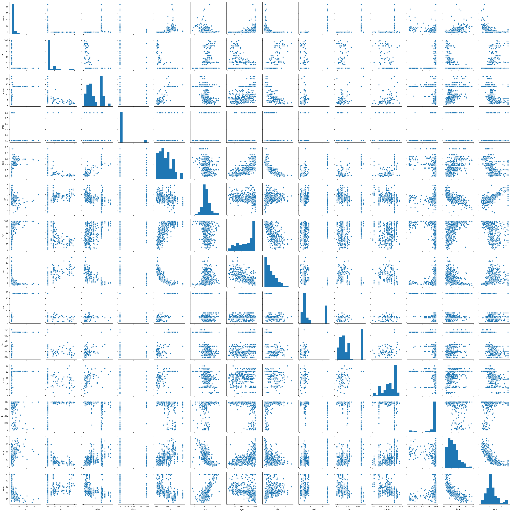


```python
corr = df.corr()
plt.figure(figsize=(15, 10))
sb.heatmap(corr, cmap="BuPu", annot=True)
corr.style.background_gradient("Blues")

```


<style  type="text/css" >
    #T_90b3dfd4_f520_11e9_a421_a44cc8d653ddrow0_col0 {
            background-color:  #08306b;
        }    #T_90b3dfd4_f520_11e9_a421_a44cc8d653ddrow0_col1 {
            background-color:  #c9ddf0;
        }    #T_90b3dfd4_f520_11e9_a421_a44cc8d653ddrow0_col2 {
            background-color:  #3a8ac2;
        }    #T_90b3dfd4_f520_11e9_a421_a44cc8d653ddrow0_col3 {
            background-color:  #ecf4fb;
        }    #T_90b3dfd4_f520_11e9_a421_a44cc8d653ddrow0_col4 {
            background-color:  #3585bf;
        }    #T_90b3dfd4_f520_11e9_a421_a44cc8d653ddrow0_col5 {
            background-color:  #c7dcef;
        }    #T_90b3dfd4_f520_11e9_a421_a44cc8d653ddrow0_col6 {
            background-color:  #4090c5;
        }    #T_90b3dfd4_f520_11e9_a421_a44cc8d653ddrow0_col7 {
            background-color:  #ccdff1;
        }    #T_90b3dfd4_f520_11e9_a421_a44cc8d653ddrow0_col8 {
            background-color:  #2171b5;
        }    #T_90b3dfd4_f520_11e9_a421_a44cc8d653ddrow0_col9 {
            background-color:  #2676b8;
        }    #T_90b3dfd4_f520_11e9_a421_a44cc8d653ddrow0_col10 {
            background-color:  #61a7d2;
        }    #T_90b3dfd4_f520_11e9_a421_a44cc8d653ddrow0_col11 {
            background-color:  #eff6fc;
        }    #T_90b3dfd4_f520_11e9_a421_a44cc8d653ddrow0_col12 {
            background-color:  #3282be;
        }    #T_90b3dfd4_f520_11e9_a421_a44cc8d653ddrow0_col13 {
            background-color:  #d0e1f2;
        }    #T_90b3dfd4_f520_11e9_a421_a44cc8d653ddrow1_col0 {
            background-color:  #dceaf6;
        }    #T_90b3dfd4_f520_11e9_a421_a44cc8d653ddrow1_col1 {
            background-color:  #08306b;
        }    #T_90b3dfd4_f520_11e9_a421_a44cc8d653ddrow1_col2 {
            background-color:  #e3eef8;
        }    #T_90b3dfd4_f520_11e9_a421_a44cc8d653ddrow1_col3 {
            background-color:  #eaf2fb;
        }    #T_90b3dfd4_f520_11e9_a421_a44cc8d653ddrow1_col4 {
            background-color:  #dbe9f6;
        }    #T_90b3dfd4_f520_11e9_a421_a44cc8d653ddrow1_col5 {
            background-color:  #539ecd;
        }    #T_90b3dfd4_f520_11e9_a421_a44cc8d653ddrow1_col6 {
            background-color:  #e3eef8;
        }    #T_90b3dfd4_f520_11e9_a421_a44cc8d653ddrow1_col7 {
            background-color:  #1561a9;
        }    #T_90b3dfd4_f520_11e9_a421_a44cc8d653ddrow1_col8 {
            background-color:  #dfebf7;
        }    #T_90b3dfd4_f520_11e9_a421_a44cc8d653ddrow1_col9 {
            background-color:  #dbe9f6;
        }    #T_90b3dfd4_f520_11e9_a421_a44cc8d653ddrow1_col10 {
            background-color:  #e8f1fa;
        }    #T_90b3dfd4_f520_11e9_a421_a44cc8d653ddrow1_col11 {
            background-color:  #89bedc;
        }    #T_90b3dfd4_f520_11e9_a421_a44cc8d653ddrow1_col12 {
            background-color:  #d3e3f3;
        }    #T_90b3dfd4_f520_11e9_a421_a44cc8d653ddrow1_col13 {
            background-color:  #4090c5;
        }    #T_90b3dfd4_f520_11e9_a421_a44cc8d653ddrow2_col0 {
            background-color:  #539ecd;
        }    #T_90b3dfd4_f520_11e9_a421_a44cc8d653ddrow2_col1 {
            background-color:  #f3f8fe;
        }    #T_90b3dfd4_f520_11e9_a421_a44cc8d653ddrow2_col2 {
            background-color:  #08306b;
        }    #T_90b3dfd4_f520_11e9_a421_a44cc8d653ddrow2_col3 {
            background-color:  #d6e6f4;
        }    #T_90b3dfd4_f520_11e9_a421_a44cc8d653ddrow2_col4 {
            background-color:  #0a539e;
        }    #T_90b3dfd4_f520_11e9_a421_a44cc8d653ddrow2_col5 {
            background-color:  #dce9f6;
        }    #T_90b3dfd4_f520_11e9_a421_a44cc8d653ddrow2_col6 {
            background-color:  #1865ac;
        }    #T_90b3dfd4_f520_11e9_a421_a44cc8d653ddrow2_col7 {
            background-color:  #f1f7fd;
        }    #T_90b3dfd4_f520_11e9_a421_a44cc8d653ddrow2_col8 {
            background-color:  #2676b8;
        }    #T_90b3dfd4_f520_11e9_a421_a44cc8d653ddrow2_col9 {
            background-color:  #135fa7;
        }    #T_90b3dfd4_f520_11e9_a421_a44cc8d653ddrow2_col10 {
            background-color:  #4d99ca;
        }    #T_90b3dfd4_f520_11e9_a421_a44cc8d653ddrow2_col11 {
            background-color:  #ebf3fb;
        }    #T_90b3dfd4_f520_11e9_a421_a44cc8d653ddrow2_col12 {
            background-color:  #1c6bb0;
        }    #T_90b3dfd4_f520_11e9_a421_a44cc8d653ddrow2_col13 {
            background-color:  #dae8f6;
        }    #T_90b3dfd4_f520_11e9_a421_a44cc8d653ddrow3_col0 {
            background-color:  #c8dcf0;
        }    #T_90b3dfd4_f520_11e9_a421_a44cc8d653ddrow3_col1 {
            background-color:  #abd0e6;
        }    #T_90b3dfd4_f520_11e9_a421_a44cc8d653ddrow3_col2 {
            background-color:  #7fb9da;
        }    #T_90b3dfd4_f520_11e9_a421_a44cc8d653ddrow3_col3 {
            background-color:  #08306b;
        }    #T_90b3dfd4_f520_11e9_a421_a44cc8d653ddrow3_col4 {
            background-color:  #71b1d7;
        }    #T_90b3dfd4_f520_11e9_a421_a44cc8d653ddrow3_col5 {
            background-color:  #85bcdc;
        }    #T_90b3dfd4_f520_11e9_a421_a44cc8d653ddrow3_col6 {
            background-color:  #74b3d8;
        }    #T_90b3dfd4_f520_11e9_a421_a44cc8d653ddrow3_col7 {
            background-color:  #9dcae1;
        }    #T_90b3dfd4_f520_11e9_a421_a44cc8d653ddrow3_col8 {
            background-color:  #aed1e7;
        }    #T_90b3dfd4_f520_11e9_a421_a44cc8d653ddrow3_col9 {
            background-color:  #aed1e7;
        }    #T_90b3dfd4_f520_11e9_a421_a44cc8d653ddrow3_col10 {
            background-color:  #c4daee;
        }    #T_90b3dfd4_f520_11e9_a421_a44cc8d653ddrow3_col11 {
            background-color:  #a9cfe5;
        }    #T_90b3dfd4_f520_11e9_a421_a44cc8d653ddrow3_col12 {
            background-color:  #97c6df;
        }    #T_90b3dfd4_f520_11e9_a421_a44cc8d653ddrow3_col13 {
            background-color:  #63a8d3;
        }    #T_90b3dfd4_f520_11e9_a421_a44cc8d653ddrow4_col0 {
            background-color:  #4f9bcb;
        }    #T_90b3dfd4_f520_11e9_a421_a44cc8d653ddrow4_col1 {
            background-color:  #f1f7fd;
        }    #T_90b3dfd4_f520_11e9_a421_a44cc8d653ddrow4_col2 {
            background-color:  #0a549e;
        }    #T_90b3dfd4_f520_11e9_a421_a44cc8d653ddrow4_col3 {
            background-color:  #d2e3f3;
        }    #T_90b3dfd4_f520_11e9_a421_a44cc8d653ddrow4_col4 {
            background-color:  #08306b;
        }    #T_90b3dfd4_f520_11e9_a421_a44cc8d653ddrow4_col5 {
            background-color:  #d1e2f3;
        }    #T_90b3dfd4_f520_11e9_a421_a44cc8d653ddrow4_col6 {
            background-color:  #0e58a2;
        }    #T_90b3dfd4_f520_11e9_a421_a44cc8d653ddrow4_col7 {
            background-color:  #f7fbff;
        }    #T_90b3dfd4_f520_11e9_a421_a44cc8d653ddrow4_col8 {
            background-color:  #2373b6;
        }    #T_90b3dfd4_f520_11e9_a421_a44cc8d653ddrow4_col9 {
            background-color:  #1a68ae;
        }    #T_90b3dfd4_f520_11e9_a421_a44cc8d653ddrow4_col10 {
            background-color:  #7ab6d9;
        }    #T_90b3dfd4_f520_11e9_a421_a44cc8d653ddrow4_col11 {
            background-color:  #eef5fc;
        }    #T_90b3dfd4_f520_11e9_a421_a44cc8d653ddrow4_col12 {
            background-color:  #1e6db2;
        }    #T_90b3dfd4_f520_11e9_a421_a44cc8d653ddrow4_col13 {
            background-color:  #d4e4f4;
        }    #T_90b3dfd4_f520_11e9_a421_a44cc8d653ddrow5_col0 {
            background-color:  #dfebf7;
        }    #T_90b3dfd4_f520_11e9_a421_a44cc8d653ddrow5_col1 {
            background-color:  #57a0ce;
        }    #T_90b3dfd4_f520_11e9_a421_a44cc8d653ddrow5_col2 {
            background-color:  #d3e3f3;
        }    #T_90b3dfd4_f520_11e9_a421_a44cc8d653ddrow5_col3 {
            background-color:  #d2e3f3;
        }    #T_90b3dfd4_f520_11e9_a421_a44cc8d653ddrow5_col4 {
            background-color:  #c2d9ee;
        }    #T_90b3dfd4_f520_11e9_a421_a44cc8d653ddrow5_col5 {
            background-color:  #08306b;
        }    #T_90b3dfd4_f520_11e9_a421_a44cc8d653ddrow5_col6 {
            background-color:  #b9d6ea;
        }    #T_90b3dfd4_f520_11e9_a421_a44cc8d653ddrow5_col7 {
            background-color:  #5aa2cf;
        }    #T_90b3dfd4_f520_11e9_a421_a44cc8d653ddrow5_col8 {
            background-color:  #d2e3f3;
        }    #T_90b3dfd4_f520_11e9_a421_a44cc8d653ddrow5_col9 {
            background-color:  #d8e7f5;
        }    #T_90b3dfd4_f520_11e9_a421_a44cc8d653ddrow5_col10 {
            background-color:  #e3eef9;
        }    #T_90b3dfd4_f520_11e9_a421_a44cc8d653ddrow5_col11 {
            background-color:  #95c5df;
        }    #T_90b3dfd4_f520_11e9_a421_a44cc8d653ddrow5_col12 {
            background-color:  #e9f2fa;
        }    #T_90b3dfd4_f520_11e9_a421_a44cc8d653ddrow5_col13 {
            background-color:  #125da6;
        }    #T_90b3dfd4_f520_11e9_a421_a44cc8d653ddrow6_col0 {
            background-color:  #60a7d2;
        }    #T_90b3dfd4_f520_11e9_a421_a44cc8d653ddrow6_col1 {
            background-color:  #f7fbff;
        }    #T_90b3dfd4_f520_11e9_a421_a44cc8d653ddrow6_col2 {
            background-color:  #1966ad;
        }    #T_90b3dfd4_f520_11e9_a421_a44cc8d653ddrow6_col3 {
            background-color:  #d3e3f3;
        }    #T_90b3dfd4_f520_11e9_a421_a44cc8d653ddrow6_col4 {
            background-color:  #0d57a1;
        }    #T_90b3dfd4_f520_11e9_a421_a44cc8d653ddrow6_col5 {
            background-color:  #caddf0;
        }    #T_90b3dfd4_f520_11e9_a421_a44cc8d653ddrow6_col6 {
            background-color:  #08306b;
        }    #T_90b3dfd4_f520_11e9_a421_a44cc8d653ddrow6_col7 {
            background-color:  #f5f9fe;
        }    #T_90b3dfd4_f520_11e9_a421_a44cc8d653ddrow6_col8 {
            background-color:  #3f8fc5;
        }    #T_90b3dfd4_f520_11e9_a421_a44cc8d653ddrow6_col9 {
            background-color:  #3484bf;
        }    #T_90b3dfd4_f520_11e9_a421_a44cc8d653ddrow6_col10 {
            background-color:  #68acd5;
        }    #T_90b3dfd4_f520_11e9_a421_a44cc8d653ddrow6_col11 {
            background-color:  #dfecf7;
        }    #T_90b3dfd4_f520_11e9_a421_a44cc8d653ddrow6_col12 {
            background-color:  #1c6bb0;
        }    #T_90b3dfd4_f520_11e9_a421_a44cc8d653ddrow6_col13 {
            background-color:  #cee0f2;
        }    #T_90b3dfd4_f520_11e9_a421_a44cc8d653ddrow7_col0 {
            background-color:  #f6faff;
        }    #T_90b3dfd4_f520_11e9_a421_a44cc8d653ddrow7_col1 {
            background-color:  #1967ad;
        }    #T_90b3dfd4_f520_11e9_a421_a44cc8d653ddrow7_col2 {
            background-color:  #f7fbff;
        }    #T_90b3dfd4_f520_11e9_a421_a44cc8d653ddrow7_col3 {
            background-color:  #f3f8fe;
        }    #T_90b3dfd4_f520_11e9_a421_a44cc8d653ddrow7_col4 {
            background-color:  #f7fbff;
        }    #T_90b3dfd4_f520_11e9_a421_a44cc8d653ddrow7_col5 {
            background-color:  #69add5;
        }    #T_90b3dfd4_f520_11e9_a421_a44cc8d653ddrow7_col6 {
            background-color:  #f7fbff;
        }    #T_90b3dfd4_f520_11e9_a421_a44cc8d653ddrow7_col7 {
            background-color:  #08306b;
        }    #T_90b3dfd4_f520_11e9_a421_a44cc8d653ddrow7_col8 {
            background-color:  #f7fbff;
        }    #T_90b3dfd4_f520_11e9_a421_a44cc8d653ddrow7_col9 {
            background-color:  #f7fbff;
        }    #T_90b3dfd4_f520_11e9_a421_a44cc8d653ddrow7_col10 {
            background-color:  #d3e4f3;
        }    #T_90b3dfd4_f520_11e9_a421_a44cc8d653ddrow7_col11 {
            background-color:  #68acd5;
        }    #T_90b3dfd4_f520_11e9_a421_a44cc8d653ddrow7_col12 {
            background-color:  #dce9f6;
        }    #T_90b3dfd4_f520_11e9_a421_a44cc8d653ddrow7_col13 {
            background-color:  #549fcd;
        }    #T_90b3dfd4_f520_11e9_a421_a44cc8d653ddrow8_col0 {
            background-color:  #2676b8;
        }    #T_90b3dfd4_f520_11e9_a421_a44cc8d653ddrow8_col1 {
            background-color:  #d6e6f4;
        }    #T_90b3dfd4_f520_11e9_a421_a44cc8d653ddrow8_col2 {
            background-color:  #1e6db2;
        }    #T_90b3dfd4_f520_11e9_a421_a44cc8d653ddrow8_col3 {
            background-color:  #e3eef8;
        }    #T_90b3dfd4_f520_11e9_a421_a44cc8d653ddrow8_col4 {
            background-color:  #1b69af;
        }    #T_90b3dfd4_f520_11e9_a421_a44cc8d653ddrow8_col5 {
            background-color:  #c6dbef;
        }    #T_90b3dfd4_f520_11e9_a421_a44cc8d653ddrow8_col6 {
            background-color:  #3181bd;
        }    #T_90b3dfd4_f520_11e9_a421_a44cc8d653ddrow8_col7 {
            background-color:  #d9e7f5;
        }    #T_90b3dfd4_f520_11e9_a421_a44cc8d653ddrow8_col8 {
            background-color:  #08306b;
        }    #T_90b3dfd4_f520_11e9_a421_a44cc8d653ddrow8_col9 {
            background-color:  #083e81;
        }    #T_90b3dfd4_f520_11e9_a421_a44cc8d653ddrow8_col10 {
            background-color:  #3c8cc3;
        }    #T_90b3dfd4_f520_11e9_a421_a44cc8d653ddrow8_col11 {
            background-color:  #f7fbff;
        }    #T_90b3dfd4_f520_11e9_a421_a44cc8d653ddrow8_col12 {
            background-color:  #2d7dbb;
        }    #T_90b3dfd4_f520_11e9_a421_a44cc8d653ddrow8_col13 {
            background-color:  #cfe1f2;
        }    #T_90b3dfd4_f520_11e9_a421_a44cc8d653ddrow9_col0 {
            background-color:  #2e7ebc;
        }    #T_90b3dfd4_f520_11e9_a421_a44cc8d653ddrow9_col1 {
            background-color:  #d7e6f5;
        }    #T_90b3dfd4_f520_11e9_a421_a44cc8d653ddrow9_col2 {
            background-color:  #0f5aa3;
        }    #T_90b3dfd4_f520_11e9_a421_a44cc8d653ddrow9_col3 {
            background-color:  #e8f1fa;
        }    #T_90b3dfd4_f520_11e9_a421_a44cc8d653ddrow9_col4 {
            background-color:  #1561a9;
        }    #T_90b3dfd4_f520_11e9_a421_a44cc8d653ddrow9_col5 {
            background-color:  #d0e1f2;
        }    #T_90b3dfd4_f520_11e9_a421_a44cc8d653ddrow9_col6 {
            background-color:  #2a7ab9;
        }    #T_90b3dfd4_f520_11e9_a421_a44cc8d653ddrow9_col7 {
            background-color:  #ddeaf7;
        }    #T_90b3dfd4_f520_11e9_a421_a44cc8d653ddrow9_col8 {
            background-color:  #084082;
        }    #T_90b3dfd4_f520_11e9_a421_a44cc8d653ddrow9_col9 {
            background-color:  #08306b;
        }    #T_90b3dfd4_f520_11e9_a421_a44cc8d653ddrow9_col10 {
            background-color:  #3d8dc4;
        }    #T_90b3dfd4_f520_11e9_a421_a44cc8d653ddrow9_col11 {
            background-color:  #f7fbff;
        }    #T_90b3dfd4_f520_11e9_a421_a44cc8d653ddrow9_col12 {
            background-color:  #2474b7;
        }    #T_90b3dfd4_f520_11e9_a421_a44cc8d653ddrow9_col13 {
            background-color:  #d9e7f5;
        }    #T_90b3dfd4_f520_11e9_a421_a44cc8d653ddrow10_col0 {
            background-color:  #6fb0d7;
        }    #T_90b3dfd4_f520_11e9_a421_a44cc8d653ddrow10_col1 {
            background-color:  #e0ecf8;
        }    #T_90b3dfd4_f520_11e9_a421_a44cc8d653ddrow10_col2 {
            background-color:  #3e8ec4;
        }    #T_90b3dfd4_f520_11e9_a421_a44cc8d653ddrow10_col3 {
            background-color:  #f7fbff;
        }    #T_90b3dfd4_f520_11e9_a421_a44cc8d653ddrow10_col4 {
            background-color:  #5da5d1;
        }    #T_90b3dfd4_f520_11e9_a421_a44cc8d653ddrow10_col5 {
            background-color:  #d8e7f5;
        }    #T_90b3dfd4_f520_11e9_a421_a44cc8d653ddrow10_col6 {
            background-color:  #529dcc;
        }    #T_90b3dfd4_f520_11e9_a421_a44cc8d653ddrow10_col7 {
            background-color:  #b5d4e9;
        }    #T_90b3dfd4_f520_11e9_a421_a44cc8d653ddrow10_col8 {
            background-color:  #3d8dc4;
        }    #T_90b3dfd4_f520_11e9_a421_a44cc8d653ddrow10_col9 {
            background-color:  #3b8bc2;
        }    #T_90b3dfd4_f520_11e9_a421_a44cc8d653ddrow10_col10 {
            background-color:  #08306b;
        }    #T_90b3dfd4_f520_11e9_a421_a44cc8d653ddrow10_col11 {
            background-color:  #d3e3f3;
        }    #T_90b3dfd4_f520_11e9_a421_a44cc8d653ddrow10_col12 {
            background-color:  #3e8ec4;
        }    #T_90b3dfd4_f520_11e9_a421_a44cc8d653ddrow10_col13 {
            background-color:  #ddeaf7;
        }    #T_90b3dfd4_f520_11e9_a421_a44cc8d653ddrow11_col0 {
            background-color:  #f7fbff;
        }    #T_90b3dfd4_f520_11e9_a421_a44cc8d653ddrow11_col1 {
            background-color:  #75b4d8;
        }    #T_90b3dfd4_f520_11e9_a421_a44cc8d653ddrow11_col2 {
            background-color:  #cfe1f2;
        }    #T_90b3dfd4_f520_11e9_a421_a44cc8d653ddrow11_col3 {
            background-color:  #d9e8f5;
        }    #T_90b3dfd4_f520_11e9_a421_a44cc8d653ddrow11_col4 {
            background-color:  #ccdff1;
        }    #T_90b3dfd4_f520_11e9_a421_a44cc8d653ddrow11_col5 {
            background-color:  #7cb7da;
        }    #T_90b3dfd4_f520_11e9_a421_a44cc8d653ddrow11_col6 {
            background-color:  #bfd8ed;
        }    #T_90b3dfd4_f520_11e9_a421_a44cc8d653ddrow11_col7 {
            background-color:  #4a98c9;
        }    #T_90b3dfd4_f520_11e9_a421_a44cc8d653ddrow11_col8 {
            background-color:  #f1f7fd;
        }    #T_90b3dfd4_f520_11e9_a421_a44cc8d653ddrow11_col9 {
            background-color:  #ebf3fb;
        }    #T_90b3dfd4_f520_11e9_a421_a44cc8d653ddrow11_col10 {
            background-color:  #ccdff1;
        }    #T_90b3dfd4_f520_11e9_a421_a44cc8d653ddrow11_col11 {
            background-color:  #08306b;
        }    #T_90b3dfd4_f520_11e9_a421_a44cc8d653ddrow11_col12 {
            background-color:  #cde0f1;
        }    #T_90b3dfd4_f520_11e9_a421_a44cc8d653ddrow11_col13 {
            background-color:  #4594c7;
        }    #T_90b3dfd4_f520_11e9_a421_a44cc8d653ddrow12_col0 {
            background-color:  #4896c8;
        }    #T_90b3dfd4_f520_11e9_a421_a44cc8d653ddrow12_col1 {
            background-color:  #e3eef9;
        }    #T_90b3dfd4_f520_11e9_a421_a44cc8d653ddrow12_col2 {
            background-color:  #1d6cb1;
        }    #T_90b3dfd4_f520_11e9_a421_a44cc8d653ddrow12_col3 {
            background-color:  #ebf3fb;
        }    #T_90b3dfd4_f520_11e9_a421_a44cc8d653ddrow12_col4 {
            background-color:  #1d6cb1;
        }    #T_90b3dfd4_f520_11e9_a421_a44cc8d653ddrow12_col5 {
            background-color:  #f7fbff;
        }    #T_90b3dfd4_f520_11e9_a421_a44cc8d653ddrow12_col6 {
            background-color:  #1c6bb0;
        }    #T_90b3dfd4_f520_11e9_a421_a44cc8d653ddrow12_col7 {
            background-color:  #d9e7f5;
        }    #T_90b3dfd4_f520_11e9_a421_a44cc8d653ddrow12_col8 {
            background-color:  #3989c1;
        }    #T_90b3dfd4_f520_11e9_a421_a44cc8d653ddrow12_col9 {
            background-color:  #2e7ebc;
        }    #T_90b3dfd4_f520_11e9_a421_a44cc8d653ddrow12_col10 {
            background-color:  #4f9bcb;
        }    #T_90b3dfd4_f520_11e9_a421_a44cc8d653ddrow12_col11 {
            background-color:  #edf4fc;
        }    #T_90b3dfd4_f520_11e9_a421_a44cc8d653ddrow12_col12 {
            background-color:  #08306b;
        }    #T_90b3dfd4_f520_11e9_a421_a44cc8d653ddrow12_col13 {
            background-color:  #f7fbff;
        }    #T_90b3dfd4_f520_11e9_a421_a44cc8d653ddrow13_col0 {
            background-color:  #f7fbff;
        }    #T_90b3dfd4_f520_11e9_a421_a44cc8d653ddrow13_col1 {
            background-color:  #4d99ca;
        }    #T_90b3dfd4_f520_11e9_a421_a44cc8d653ddrow13_col2 {
            background-color:  #ddeaf7;
        }    #T_90b3dfd4_f520_11e9_a421_a44cc8d653ddrow13_col3 {
            background-color:  #c2d9ee;
        }    #T_90b3dfd4_f520_11e9_a421_a44cc8d653ddrow13_col4 {
            background-color:  #d1e2f3;
        }    #T_90b3dfd4_f520_11e9_a421_a44cc8d653ddrow13_col5 {
            background-color:  #1561a9;
        }    #T_90b3dfd4_f520_11e9_a421_a44cc8d653ddrow13_col6 {
            background-color:  #cde0f1;
        }    #T_90b3dfd4_f520_11e9_a421_a44cc8d653ddrow13_col7 {
            background-color:  #529dcc;
        }    #T_90b3dfd4_f520_11e9_a421_a44cc8d653ddrow13_col8 {
            background-color:  #e8f1fa;
        }    #T_90b3dfd4_f520_11e9_a421_a44cc8d653ddrow13_col9 {
            background-color:  #eff6fc;
        }    #T_90b3dfd4_f520_11e9_a421_a44cc8d653ddrow13_col10 {
            background-color:  #f7fbff;
        }    #T_90b3dfd4_f520_11e9_a421_a44cc8d653ddrow13_col11 {
            background-color:  #5fa6d1;
        }    #T_90b3dfd4_f520_11e9_a421_a44cc8d653ddrow13_col12 {
            background-color:  #f7fbff;
        }    #T_90b3dfd4_f520_11e9_a421_a44cc8d653ddrow13_col13 {
            background-color:  #08306b;
        }</style>  
<table id="T_90b3dfd4_f520_11e9_a421_a44cc8d653dd" > 
<thead>    <tr> 
        <th class="blank level0" ></th> 
        <th class="col_heading level0 col0" >crim</th> 
        <th class="col_heading level0 col1" >zn</th> 
        <th class="col_heading level0 col2" >indus</th> 
        <th class="col_heading level0 col3" >chas</th> 
        <th class="col_heading level0 col4" >nox</th> 
        <th class="col_heading level0 col5" >rm</th> 
        <th class="col_heading level0 col6" >age</th> 
        <th class="col_heading level0 col7" >dis</th> 
        <th class="col_heading level0 col8" >rad</th> 
        <th class="col_heading level0 col9" >tax</th> 
        <th class="col_heading level0 col10" >ptratio</th> 
        <th class="col_heading level0 col11" >b</th> 
        <th class="col_heading level0 col12" >lstat</th> 
        <th class="col_heading level0 col13" >medv</th> 
    </tr></thead> 
<tbody>    <tr> 
        <th id="T_90b3dfd4_f520_11e9_a421_a44cc8d653ddlevel0_row0" class="row_heading level0 row0" >crim</th> 
        <td id="T_90b3dfd4_f520_11e9_a421_a44cc8d653ddrow0_col0" class="data row0 col0" >1</td> 
        <td id="T_90b3dfd4_f520_11e9_a421_a44cc8d653ddrow0_col1" class="data row0 col1" >-0.200469</td> 
        <td id="T_90b3dfd4_f520_11e9_a421_a44cc8d653ddrow0_col2" class="data row0 col2" >0.406583</td> 
        <td id="T_90b3dfd4_f520_11e9_a421_a44cc8d653ddrow0_col3" class="data row0 col3" >-0.0558916</td> 
        <td id="T_90b3dfd4_f520_11e9_a421_a44cc8d653ddrow0_col4" class="data row0 col4" >0.420972</td> 
        <td id="T_90b3dfd4_f520_11e9_a421_a44cc8d653ddrow0_col5" class="data row0 col5" >-0.219247</td> 
        <td id="T_90b3dfd4_f520_11e9_a421_a44cc8d653ddrow0_col6" class="data row0 col6" >0.352734</td> 
        <td id="T_90b3dfd4_f520_11e9_a421_a44cc8d653ddrow0_col7" class="data row0 col7" >-0.37967</td> 
        <td id="T_90b3dfd4_f520_11e9_a421_a44cc8d653ddrow0_col8" class="data row0 col8" >0.625505</td> 
        <td id="T_90b3dfd4_f520_11e9_a421_a44cc8d653ddrow0_col9" class="data row0 col9" >0.582764</td> 
        <td id="T_90b3dfd4_f520_11e9_a421_a44cc8d653ddrow0_col10" class="data row0 col10" >0.289946</td> 
        <td id="T_90b3dfd4_f520_11e9_a421_a44cc8d653ddrow0_col11" class="data row0 col11" >-0.385064</td> 
        <td id="T_90b3dfd4_f520_11e9_a421_a44cc8d653ddrow0_col12" class="data row0 col12" >0.455621</td> 
        <td id="T_90b3dfd4_f520_11e9_a421_a44cc8d653ddrow0_col13" class="data row0 col13" >-0.388305</td> 
    </tr>    <tr> 
        <th id="T_90b3dfd4_f520_11e9_a421_a44cc8d653ddlevel0_row1" class="row_heading level0 row1" >zn</th> 
        <td id="T_90b3dfd4_f520_11e9_a421_a44cc8d653ddrow1_col0" class="data row1 col0" >-0.200469</td> 
        <td id="T_90b3dfd4_f520_11e9_a421_a44cc8d653ddrow1_col1" class="data row1 col1" >1</td> 
        <td id="T_90b3dfd4_f520_11e9_a421_a44cc8d653ddrow1_col2" class="data row1 col2" >-0.533828</td> 
        <td id="T_90b3dfd4_f520_11e9_a421_a44cc8d653ddrow1_col3" class="data row1 col3" >-0.0426967</td> 
        <td id="T_90b3dfd4_f520_11e9_a421_a44cc8d653ddrow1_col4" class="data row1 col4" >-0.516604</td> 
        <td id="T_90b3dfd4_f520_11e9_a421_a44cc8d653ddrow1_col5" class="data row1 col5" >0.311991</td> 
        <td id="T_90b3dfd4_f520_11e9_a421_a44cc8d653ddrow1_col6" class="data row1 col6" >-0.569537</td> 
        <td id="T_90b3dfd4_f520_11e9_a421_a44cc8d653ddrow1_col7" class="data row1 col7" >0.664408</td> 
        <td id="T_90b3dfd4_f520_11e9_a421_a44cc8d653ddrow1_col8" class="data row1 col8" >-0.311948</td> 
        <td id="T_90b3dfd4_f520_11e9_a421_a44cc8d653ddrow1_col9" class="data row1 col9" >-0.314563</td> 
        <td id="T_90b3dfd4_f520_11e9_a421_a44cc8d653ddrow1_col10" class="data row1 col10" >-0.391679</td> 
        <td id="T_90b3dfd4_f520_11e9_a421_a44cc8d653ddrow1_col11" class="data row1 col11" >0.17552</td> 
        <td id="T_90b3dfd4_f520_11e9_a421_a44cc8d653ddrow1_col12" class="data row1 col12" >-0.412995</td> 
        <td id="T_90b3dfd4_f520_11e9_a421_a44cc8d653ddrow1_col13" class="data row1 col13" >0.360445</td> 
    </tr>    <tr> 
        <th id="T_90b3dfd4_f520_11e9_a421_a44cc8d653ddlevel0_row2" class="row_heading level0 row2" >indus</th> 
        <td id="T_90b3dfd4_f520_11e9_a421_a44cc8d653ddrow2_col0" class="data row2 col0" >0.406583</td> 
        <td id="T_90b3dfd4_f520_11e9_a421_a44cc8d653ddrow2_col1" class="data row2 col1" >-0.533828</td> 
        <td id="T_90b3dfd4_f520_11e9_a421_a44cc8d653ddrow2_col2" class="data row2 col2" >1</td> 
        <td id="T_90b3dfd4_f520_11e9_a421_a44cc8d653ddrow2_col3" class="data row2 col3" >0.062938</td> 
        <td id="T_90b3dfd4_f520_11e9_a421_a44cc8d653ddrow2_col4" class="data row2 col4" >0.763651</td> 
        <td id="T_90b3dfd4_f520_11e9_a421_a44cc8d653ddrow2_col5" class="data row2 col5" >-0.391676</td> 
        <td id="T_90b3dfd4_f520_11e9_a421_a44cc8d653ddrow2_col6" class="data row2 col6" >0.644779</td> 
        <td id="T_90b3dfd4_f520_11e9_a421_a44cc8d653ddrow2_col7" class="data row2 col7" >-0.708027</td> 
        <td id="T_90b3dfd4_f520_11e9_a421_a44cc8d653ddrow2_col8" class="data row2 col8" >0.595129</td> 
        <td id="T_90b3dfd4_f520_11e9_a421_a44cc8d653ddrow2_col9" class="data row2 col9" >0.72076</td> 
        <td id="T_90b3dfd4_f520_11e9_a421_a44cc8d653ddrow2_col10" class="data row2 col10" >0.383248</td> 
        <td id="T_90b3dfd4_f520_11e9_a421_a44cc8d653ddrow2_col11" class="data row2 col11" >-0.356977</td> 
        <td id="T_90b3dfd4_f520_11e9_a421_a44cc8d653ddrow2_col12" class="data row2 col12" >0.6038</td> 
        <td id="T_90b3dfd4_f520_11e9_a421_a44cc8d653ddrow2_col13" class="data row2 col13" >-0.483725</td> 
    </tr>    <tr> 
        <th id="T_90b3dfd4_f520_11e9_a421_a44cc8d653ddlevel0_row3" class="row_heading level0 row3" >chas</th> 
        <td id="T_90b3dfd4_f520_11e9_a421_a44cc8d653ddrow3_col0" class="data row3 col0" >-0.0558916</td> 
        <td id="T_90b3dfd4_f520_11e9_a421_a44cc8d653ddrow3_col1" class="data row3 col1" >-0.0426967</td> 
        <td id="T_90b3dfd4_f520_11e9_a421_a44cc8d653ddrow3_col2" class="data row3 col2" >0.062938</td> 
        <td id="T_90b3dfd4_f520_11e9_a421_a44cc8d653ddrow3_col3" class="data row3 col3" >1</td> 
        <td id="T_90b3dfd4_f520_11e9_a421_a44cc8d653ddrow3_col4" class="data row3 col4" >0.0912028</td> 
        <td id="T_90b3dfd4_f520_11e9_a421_a44cc8d653ddrow3_col5" class="data row3 col5" >0.0912512</td> 
        <td id="T_90b3dfd4_f520_11e9_a421_a44cc8d653ddrow3_col6" class="data row3 col6" >0.0865178</td> 
        <td id="T_90b3dfd4_f520_11e9_a421_a44cc8d653ddrow3_col7" class="data row3 col7" >-0.0991758</td> 
        <td id="T_90b3dfd4_f520_11e9_a421_a44cc8d653ddrow3_col8" class="data row3 col8" >-0.00736824</td> 
        <td id="T_90b3dfd4_f520_11e9_a421_a44cc8d653ddrow3_col9" class="data row3 col9" >-0.0355865</td> 
        <td id="T_90b3dfd4_f520_11e9_a421_a44cc8d653ddrow3_col10" class="data row3 col10" >-0.121515</td> 
        <td id="T_90b3dfd4_f520_11e9_a421_a44cc8d653ddrow3_col11" class="data row3 col11" >0.0487885</td> 
        <td id="T_90b3dfd4_f520_11e9_a421_a44cc8d653ddrow3_col12" class="data row3 col12" >-0.0539293</td> 
        <td id="T_90b3dfd4_f520_11e9_a421_a44cc8d653ddrow3_col13" class="data row3 col13" >0.17526</td> 
    </tr>    <tr> 
        <th id="T_90b3dfd4_f520_11e9_a421_a44cc8d653ddlevel0_row4" class="row_heading level0 row4" >nox</th> 
        <td id="T_90b3dfd4_f520_11e9_a421_a44cc8d653ddrow4_col0" class="data row4 col0" >0.420972</td> 
        <td id="T_90b3dfd4_f520_11e9_a421_a44cc8d653ddrow4_col1" class="data row4 col1" >-0.516604</td> 
        <td id="T_90b3dfd4_f520_11e9_a421_a44cc8d653ddrow4_col2" class="data row4 col2" >0.763651</td> 
        <td id="T_90b3dfd4_f520_11e9_a421_a44cc8d653ddrow4_col3" class="data row4 col3" >0.0912028</td> 
        <td id="T_90b3dfd4_f520_11e9_a421_a44cc8d653ddrow4_col4" class="data row4 col4" >1</td> 
        <td id="T_90b3dfd4_f520_11e9_a421_a44cc8d653ddrow4_col5" class="data row4 col5" >-0.302188</td> 
        <td id="T_90b3dfd4_f520_11e9_a421_a44cc8d653ddrow4_col6" class="data row4 col6" >0.73147</td> 
        <td id="T_90b3dfd4_f520_11e9_a421_a44cc8d653ddrow4_col7" class="data row4 col7" >-0.76923</td> 
        <td id="T_90b3dfd4_f520_11e9_a421_a44cc8d653ddrow4_col8" class="data row4 col8" >0.611441</td> 
        <td id="T_90b3dfd4_f520_11e9_a421_a44cc8d653ddrow4_col9" class="data row4 col9" >0.668023</td> 
        <td id="T_90b3dfd4_f520_11e9_a421_a44cc8d653ddrow4_col10" class="data row4 col10" >0.188933</td> 
        <td id="T_90b3dfd4_f520_11e9_a421_a44cc8d653ddrow4_col11" class="data row4 col11" >-0.380051</td> 
        <td id="T_90b3dfd4_f520_11e9_a421_a44cc8d653ddrow4_col12" class="data row4 col12" >0.590879</td> 
        <td id="T_90b3dfd4_f520_11e9_a421_a44cc8d653ddrow4_col13" class="data row4 col13" >-0.427321</td> 
    </tr>    <tr> 
        <th id="T_90b3dfd4_f520_11e9_a421_a44cc8d653ddlevel0_row5" class="row_heading level0 row5" >rm</th> 
        <td id="T_90b3dfd4_f520_11e9_a421_a44cc8d653ddrow5_col0" class="data row5 col0" >-0.219247</td> 
        <td id="T_90b3dfd4_f520_11e9_a421_a44cc8d653ddrow5_col1" class="data row5 col1" >0.311991</td> 
        <td id="T_90b3dfd4_f520_11e9_a421_a44cc8d653ddrow5_col2" class="data row5 col2" >-0.391676</td> 
        <td id="T_90b3dfd4_f520_11e9_a421_a44cc8d653ddrow5_col3" class="data row5 col3" >0.0912512</td> 
        <td id="T_90b3dfd4_f520_11e9_a421_a44cc8d653ddrow5_col4" class="data row5 col4" >-0.302188</td> 
        <td id="T_90b3dfd4_f520_11e9_a421_a44cc8d653ddrow5_col5" class="data row5 col5" >1</td> 
        <td id="T_90b3dfd4_f520_11e9_a421_a44cc8d653ddrow5_col6" class="data row5 col6" >-0.240265</td> 
        <td id="T_90b3dfd4_f520_11e9_a421_a44cc8d653ddrow5_col7" class="data row5 col7" >0.205246</td> 
        <td id="T_90b3dfd4_f520_11e9_a421_a44cc8d653ddrow5_col8" class="data row5 col8" >-0.209847</td> 
        <td id="T_90b3dfd4_f520_11e9_a421_a44cc8d653ddrow5_col9" class="data row5 col9" >-0.292048</td> 
        <td id="T_90b3dfd4_f520_11e9_a421_a44cc8d653ddrow5_col10" class="data row5 col10" >-0.355501</td> 
        <td id="T_90b3dfd4_f520_11e9_a421_a44cc8d653ddrow5_col11" class="data row5 col11" >0.128069</td> 
        <td id="T_90b3dfd4_f520_11e9_a421_a44cc8d653ddrow5_col12" class="data row5 col12" >-0.613808</td> 
        <td id="T_90b3dfd4_f520_11e9_a421_a44cc8d653ddrow5_col13" class="data row5 col13" >0.69536</td> 
    </tr>    <tr> 
        <th id="T_90b3dfd4_f520_11e9_a421_a44cc8d653ddlevel0_row6" class="row_heading level0 row6" >age</th> 
        <td id="T_90b3dfd4_f520_11e9_a421_a44cc8d653ddrow6_col0" class="data row6 col0" >0.352734</td> 
        <td id="T_90b3dfd4_f520_11e9_a421_a44cc8d653ddrow6_col1" class="data row6 col1" >-0.569537</td> 
        <td id="T_90b3dfd4_f520_11e9_a421_a44cc8d653ddrow6_col2" class="data row6 col2" >0.644779</td> 
        <td id="T_90b3dfd4_f520_11e9_a421_a44cc8d653ddrow6_col3" class="data row6 col3" >0.0865178</td> 
        <td id="T_90b3dfd4_f520_11e9_a421_a44cc8d653ddrow6_col4" class="data row6 col4" >0.73147</td> 
        <td id="T_90b3dfd4_f520_11e9_a421_a44cc8d653ddrow6_col5" class="data row6 col5" >-0.240265</td> 
        <td id="T_90b3dfd4_f520_11e9_a421_a44cc8d653ddrow6_col6" class="data row6 col6" >1</td> 
        <td id="T_90b3dfd4_f520_11e9_a421_a44cc8d653ddrow6_col7" class="data row6 col7" >-0.747881</td> 
        <td id="T_90b3dfd4_f520_11e9_a421_a44cc8d653ddrow6_col8" class="data row6 col8" >0.456022</td> 
        <td id="T_90b3dfd4_f520_11e9_a421_a44cc8d653ddrow6_col9" class="data row6 col9" >0.506456</td> 
        <td id="T_90b3dfd4_f520_11e9_a421_a44cc8d653ddrow6_col10" class="data row6 col10" >0.261515</td> 
        <td id="T_90b3dfd4_f520_11e9_a421_a44cc8d653ddrow6_col11" class="data row6 col11" >-0.273534</td> 
        <td id="T_90b3dfd4_f520_11e9_a421_a44cc8d653ddrow6_col12" class="data row6 col12" >0.602339</td> 
        <td id="T_90b3dfd4_f520_11e9_a421_a44cc8d653ddrow6_col13" class="data row6 col13" >-0.376955</td> 
    </tr>    <tr> 
        <th id="T_90b3dfd4_f520_11e9_a421_a44cc8d653ddlevel0_row7" class="row_heading level0 row7" >dis</th> 
        <td id="T_90b3dfd4_f520_11e9_a421_a44cc8d653ddrow7_col0" class="data row7 col0" >-0.37967</td> 
        <td id="T_90b3dfd4_f520_11e9_a421_a44cc8d653ddrow7_col1" class="data row7 col1" >0.664408</td> 
        <td id="T_90b3dfd4_f520_11e9_a421_a44cc8d653ddrow7_col2" class="data row7 col2" >-0.708027</td> 
        <td id="T_90b3dfd4_f520_11e9_a421_a44cc8d653ddrow7_col3" class="data row7 col3" >-0.0991758</td> 
        <td id="T_90b3dfd4_f520_11e9_a421_a44cc8d653ddrow7_col4" class="data row7 col4" >-0.76923</td> 
        <td id="T_90b3dfd4_f520_11e9_a421_a44cc8d653ddrow7_col5" class="data row7 col5" >0.205246</td> 
        <td id="T_90b3dfd4_f520_11e9_a421_a44cc8d653ddrow7_col6" class="data row7 col6" >-0.747881</td> 
        <td id="T_90b3dfd4_f520_11e9_a421_a44cc8d653ddrow7_col7" class="data row7 col7" >1</td> 
        <td id="T_90b3dfd4_f520_11e9_a421_a44cc8d653ddrow7_col8" class="data row7 col8" >-0.494588</td> 
        <td id="T_90b3dfd4_f520_11e9_a421_a44cc8d653ddrow7_col9" class="data row7 col9" >-0.534432</td> 
        <td id="T_90b3dfd4_f520_11e9_a421_a44cc8d653ddrow7_col10" class="data row7 col10" >-0.232471</td> 
        <td id="T_90b3dfd4_f520_11e9_a421_a44cc8d653ddrow7_col11" class="data row7 col11" >0.291512</td> 
        <td id="T_90b3dfd4_f520_11e9_a421_a44cc8d653ddrow7_col12" class="data row7 col12" >-0.496996</td> 
        <td id="T_90b3dfd4_f520_11e9_a421_a44cc8d653ddrow7_col13" class="data row7 col13" >0.249929</td> 
    </tr>    <tr> 
        <th id="T_90b3dfd4_f520_11e9_a421_a44cc8d653ddlevel0_row8" class="row_heading level0 row8" >rad</th> 
        <td id="T_90b3dfd4_f520_11e9_a421_a44cc8d653ddrow8_col0" class="data row8 col0" >0.625505</td> 
        <td id="T_90b3dfd4_f520_11e9_a421_a44cc8d653ddrow8_col1" class="data row8 col1" >-0.311948</td> 
        <td id="T_90b3dfd4_f520_11e9_a421_a44cc8d653ddrow8_col2" class="data row8 col2" >0.595129</td> 
        <td id="T_90b3dfd4_f520_11e9_a421_a44cc8d653ddrow8_col3" class="data row8 col3" >-0.00736824</td> 
        <td id="T_90b3dfd4_f520_11e9_a421_a44cc8d653ddrow8_col4" class="data row8 col4" >0.611441</td> 
        <td id="T_90b3dfd4_f520_11e9_a421_a44cc8d653ddrow8_col5" class="data row8 col5" >-0.209847</td> 
        <td id="T_90b3dfd4_f520_11e9_a421_a44cc8d653ddrow8_col6" class="data row8 col6" >0.456022</td> 
        <td id="T_90b3dfd4_f520_11e9_a421_a44cc8d653ddrow8_col7" class="data row8 col7" >-0.494588</td> 
        <td id="T_90b3dfd4_f520_11e9_a421_a44cc8d653ddrow8_col8" class="data row8 col8" >1</td> 
        <td id="T_90b3dfd4_f520_11e9_a421_a44cc8d653ddrow8_col9" class="data row8 col9" >0.910228</td> 
        <td id="T_90b3dfd4_f520_11e9_a421_a44cc8d653ddrow8_col10" class="data row8 col10" >0.464741</td> 
        <td id="T_90b3dfd4_f520_11e9_a421_a44cc8d653ddrow8_col11" class="data row8 col11" >-0.444413</td> 
        <td id="T_90b3dfd4_f520_11e9_a421_a44cc8d653ddrow8_col12" class="data row8 col12" >0.488676</td> 
        <td id="T_90b3dfd4_f520_11e9_a421_a44cc8d653ddrow8_col13" class="data row8 col13" >-0.381626</td> 
    </tr>    <tr> 
        <th id="T_90b3dfd4_f520_11e9_a421_a44cc8d653ddlevel0_row9" class="row_heading level0 row9" >tax</th> 
        <td id="T_90b3dfd4_f520_11e9_a421_a44cc8d653ddrow9_col0" class="data row9 col0" >0.582764</td> 
        <td id="T_90b3dfd4_f520_11e9_a421_a44cc8d653ddrow9_col1" class="data row9 col1" >-0.314563</td> 
        <td id="T_90b3dfd4_f520_11e9_a421_a44cc8d653ddrow9_col2" class="data row9 col2" >0.72076</td> 
        <td id="T_90b3dfd4_f520_11e9_a421_a44cc8d653ddrow9_col3" class="data row9 col3" >-0.0355865</td> 
        <td id="T_90b3dfd4_f520_11e9_a421_a44cc8d653ddrow9_col4" class="data row9 col4" >0.668023</td> 
        <td id="T_90b3dfd4_f520_11e9_a421_a44cc8d653ddrow9_col5" class="data row9 col5" >-0.292048</td> 
        <td id="T_90b3dfd4_f520_11e9_a421_a44cc8d653ddrow9_col6" class="data row9 col6" >0.506456</td> 
        <td id="T_90b3dfd4_f520_11e9_a421_a44cc8d653ddrow9_col7" class="data row9 col7" >-0.534432</td> 
        <td id="T_90b3dfd4_f520_11e9_a421_a44cc8d653ddrow9_col8" class="data row9 col8" >0.910228</td> 
        <td id="T_90b3dfd4_f520_11e9_a421_a44cc8d653ddrow9_col9" class="data row9 col9" >1</td> 
        <td id="T_90b3dfd4_f520_11e9_a421_a44cc8d653ddrow9_col10" class="data row9 col10" >0.460853</td> 
        <td id="T_90b3dfd4_f520_11e9_a421_a44cc8d653ddrow9_col11" class="data row9 col11" >-0.441808</td> 
        <td id="T_90b3dfd4_f520_11e9_a421_a44cc8d653ddrow9_col12" class="data row9 col12" >0.543993</td> 
        <td id="T_90b3dfd4_f520_11e9_a421_a44cc8d653ddrow9_col13" class="data row9 col13" >-0.468536</td> 
    </tr>    <tr> 
        <th id="T_90b3dfd4_f520_11e9_a421_a44cc8d653ddlevel0_row10" class="row_heading level0 row10" >ptratio</th> 
        <td id="T_90b3dfd4_f520_11e9_a421_a44cc8d653ddrow10_col0" class="data row10 col0" >0.289946</td> 
        <td id="T_90b3dfd4_f520_11e9_a421_a44cc8d653ddrow10_col1" class="data row10 col1" >-0.391679</td> 
        <td id="T_90b3dfd4_f520_11e9_a421_a44cc8d653ddrow10_col2" class="data row10 col2" >0.383248</td> 
        <td id="T_90b3dfd4_f520_11e9_a421_a44cc8d653ddrow10_col3" class="data row10 col3" >-0.121515</td> 
        <td id="T_90b3dfd4_f520_11e9_a421_a44cc8d653ddrow10_col4" class="data row10 col4" >0.188933</td> 
        <td id="T_90b3dfd4_f520_11e9_a421_a44cc8d653ddrow10_col5" class="data row10 col5" >-0.355501</td> 
        <td id="T_90b3dfd4_f520_11e9_a421_a44cc8d653ddrow10_col6" class="data row10 col6" >0.261515</td> 
        <td id="T_90b3dfd4_f520_11e9_a421_a44cc8d653ddrow10_col7" class="data row10 col7" >-0.232471</td> 
        <td id="T_90b3dfd4_f520_11e9_a421_a44cc8d653ddrow10_col8" class="data row10 col8" >0.464741</td> 
        <td id="T_90b3dfd4_f520_11e9_a421_a44cc8d653ddrow10_col9" class="data row10 col9" >0.460853</td> 
        <td id="T_90b3dfd4_f520_11e9_a421_a44cc8d653ddrow10_col10" class="data row10 col10" >1</td> 
        <td id="T_90b3dfd4_f520_11e9_a421_a44cc8d653ddrow10_col11" class="data row10 col11" >-0.177383</td> 
        <td id="T_90b3dfd4_f520_11e9_a421_a44cc8d653ddrow10_col12" class="data row10 col12" >0.374044</td> 
        <td id="T_90b3dfd4_f520_11e9_a421_a44cc8d653ddrow10_col13" class="data row10 col13" >-0.507787</td> 
    </tr>    <tr> 
        <th id="T_90b3dfd4_f520_11e9_a421_a44cc8d653ddlevel0_row11" class="row_heading level0 row11" >b</th> 
        <td id="T_90b3dfd4_f520_11e9_a421_a44cc8d653ddrow11_col0" class="data row11 col0" >-0.385064</td> 
        <td id="T_90b3dfd4_f520_11e9_a421_a44cc8d653ddrow11_col1" class="data row11 col1" >0.17552</td> 
        <td id="T_90b3dfd4_f520_11e9_a421_a44cc8d653ddrow11_col2" class="data row11 col2" >-0.356977</td> 
        <td id="T_90b3dfd4_f520_11e9_a421_a44cc8d653ddrow11_col3" class="data row11 col3" >0.0487885</td> 
        <td id="T_90b3dfd4_f520_11e9_a421_a44cc8d653ddrow11_col4" class="data row11 col4" >-0.380051</td> 
        <td id="T_90b3dfd4_f520_11e9_a421_a44cc8d653ddrow11_col5" class="data row11 col5" >0.128069</td> 
        <td id="T_90b3dfd4_f520_11e9_a421_a44cc8d653ddrow11_col6" class="data row11 col6" >-0.273534</td> 
        <td id="T_90b3dfd4_f520_11e9_a421_a44cc8d653ddrow11_col7" class="data row11 col7" >0.291512</td> 
        <td id="T_90b3dfd4_f520_11e9_a421_a44cc8d653ddrow11_col8" class="data row11 col8" >-0.444413</td> 
        <td id="T_90b3dfd4_f520_11e9_a421_a44cc8d653ddrow11_col9" class="data row11 col9" >-0.441808</td> 
        <td id="T_90b3dfd4_f520_11e9_a421_a44cc8d653ddrow11_col10" class="data row11 col10" >-0.177383</td> 
        <td id="T_90b3dfd4_f520_11e9_a421_a44cc8d653ddrow11_col11" class="data row11 col11" >1</td> 
        <td id="T_90b3dfd4_f520_11e9_a421_a44cc8d653ddrow11_col12" class="data row11 col12" >-0.366087</td> 
        <td id="T_90b3dfd4_f520_11e9_a421_a44cc8d653ddrow11_col13" class="data row11 col13" >0.333461</td> 
    </tr>    <tr> 
        <th id="T_90b3dfd4_f520_11e9_a421_a44cc8d653ddlevel0_row12" class="row_heading level0 row12" >lstat</th> 
        <td id="T_90b3dfd4_f520_11e9_a421_a44cc8d653ddrow12_col0" class="data row12 col0" >0.455621</td> 
        <td id="T_90b3dfd4_f520_11e9_a421_a44cc8d653ddrow12_col1" class="data row12 col1" >-0.412995</td> 
        <td id="T_90b3dfd4_f520_11e9_a421_a44cc8d653ddrow12_col2" class="data row12 col2" >0.6038</td> 
        <td id="T_90b3dfd4_f520_11e9_a421_a44cc8d653ddrow12_col3" class="data row12 col3" >-0.0539293</td> 
        <td id="T_90b3dfd4_f520_11e9_a421_a44cc8d653ddrow12_col4" class="data row12 col4" >0.590879</td> 
        <td id="T_90b3dfd4_f520_11e9_a421_a44cc8d653ddrow12_col5" class="data row12 col5" >-0.613808</td> 
        <td id="T_90b3dfd4_f520_11e9_a421_a44cc8d653ddrow12_col6" class="data row12 col6" >0.602339</td> 
        <td id="T_90b3dfd4_f520_11e9_a421_a44cc8d653ddrow12_col7" class="data row12 col7" >-0.496996</td> 
        <td id="T_90b3dfd4_f520_11e9_a421_a44cc8d653ddrow12_col8" class="data row12 col8" >0.488676</td> 
        <td id="T_90b3dfd4_f520_11e9_a421_a44cc8d653ddrow12_col9" class="data row12 col9" >0.543993</td> 
        <td id="T_90b3dfd4_f520_11e9_a421_a44cc8d653ddrow12_col10" class="data row12 col10" >0.374044</td> 
        <td id="T_90b3dfd4_f520_11e9_a421_a44cc8d653ddrow12_col11" class="data row12 col11" >-0.366087</td> 
        <td id="T_90b3dfd4_f520_11e9_a421_a44cc8d653ddrow12_col12" class="data row12 col12" >1</td> 
        <td id="T_90b3dfd4_f520_11e9_a421_a44cc8d653ddrow12_col13" class="data row12 col13" >-0.737663</td> 
    </tr>    <tr> 
        <th id="T_90b3dfd4_f520_11e9_a421_a44cc8d653ddlevel0_row13" class="row_heading level0 row13" >medv</th> 
        <td id="T_90b3dfd4_f520_11e9_a421_a44cc8d653ddrow13_col0" class="data row13 col0" >-0.388305</td> 
        <td id="T_90b3dfd4_f520_11e9_a421_a44cc8d653ddrow13_col1" class="data row13 col1" >0.360445</td> 
        <td id="T_90b3dfd4_f520_11e9_a421_a44cc8d653ddrow13_col2" class="data row13 col2" >-0.483725</td> 
        <td id="T_90b3dfd4_f520_11e9_a421_a44cc8d653ddrow13_col3" class="data row13 col3" >0.17526</td> 
        <td id="T_90b3dfd4_f520_11e9_a421_a44cc8d653ddrow13_col4" class="data row13 col4" >-0.427321</td> 
        <td id="T_90b3dfd4_f520_11e9_a421_a44cc8d653ddrow13_col5" class="data row13 col5" >0.69536</td> 
        <td id="T_90b3dfd4_f520_11e9_a421_a44cc8d653ddrow13_col6" class="data row13 col6" >-0.376955</td> 
        <td id="T_90b3dfd4_f520_11e9_a421_a44cc8d653ddrow13_col7" class="data row13 col7" >0.249929</td> 
        <td id="T_90b3dfd4_f520_11e9_a421_a44cc8d653ddrow13_col8" class="data row13 col8" >-0.381626</td> 
        <td id="T_90b3dfd4_f520_11e9_a421_a44cc8d653ddrow13_col9" class="data row13 col9" >-0.468536</td> 
        <td id="T_90b3dfd4_f520_11e9_a421_a44cc8d653ddrow13_col10" class="data row13 col10" >-0.507787</td> 
        <td id="T_90b3dfd4_f520_11e9_a421_a44cc8d653ddrow13_col11" class="data row13 col11" >0.333461</td> 
        <td id="T_90b3dfd4_f520_11e9_a421_a44cc8d653ddrow13_col12" class="data row13 col12" >-0.737663</td> 
        <td id="T_90b3dfd4_f520_11e9_a421_a44cc8d653ddrow13_col13" class="data row13 col13" >1</td> 
    </tr></tbody> 
</table> 


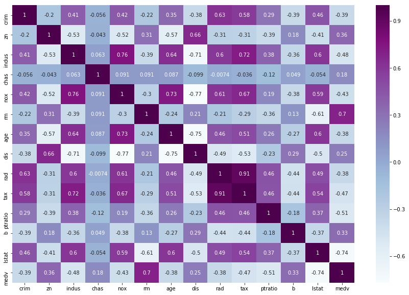


#### Print Correlation Matrix with Matplotlib


```python
corr = df.corr()
corr.style.background_gradient("Greens")
```


<style  type="text/css" >
    #T_9284a410_f520_11e9_8db4_a44cc8d653ddrow0_col0 {
            background-color:  #00441b;
        }    #T_9284a410_f520_11e9_8db4_a44cc8d653ddrow0_col1 {
            background-color:  #cbeac4;
        }    #T_9284a410_f520_11e9_8db4_a44cc8d653ddrow0_col2 {
            background-color:  #3aa357;
        }    #T_9284a410_f520_11e9_8db4_a44cc8d653ddrow0_col3 {
            background-color:  #eff9ec;
        }    #T_9284a410_f520_11e9_8db4_a44cc8d653ddrow0_col4 {
            background-color:  #359e53;
        }    #T_9284a410_f520_11e9_8db4_a44cc8d653ddrow0_col5 {
            background-color:  #c9eac2;
        }    #T_9284a410_f520_11e9_8db4_a44cc8d653ddrow0_col6 {
            background-color:  #3fa95c;
        }    #T_9284a410_f520_11e9_8db4_a44cc8d653ddrow0_col7 {
            background-color:  #ceecc8;
        }    #T_9284a410_f520_11e9_8db4_a44cc8d653ddrow0_col8 {
            background-color:  #238b45;
        }    #T_9284a410_f520_11e9_8db4_a44cc8d653ddrow0_col9 {
            background-color:  #289049;
        }    #T_9284a410_f520_11e9_8db4_a44cc8d653ddrow0_col10 {
            background-color:  #68be70;
        }    #T_9284a410_f520_11e9_8db4_a44cc8d653ddrow0_col11 {
            background-color:  #f1faee;
        }    #T_9284a410_f520_11e9_8db4_a44cc8d653ddrow0_col12 {
            background-color:  #329b51;
        }    #T_9284a410_f520_11e9_8db4_a44cc8d653ddrow0_col13 {
            background-color:  #d3eecd;
        }    #T_9284a410_f520_11e9_8db4_a44cc8d653ddrow1_col0 {
            background-color:  #e3f4de;
        }    #T_9284a410_f520_11e9_8db4_a44cc8d653ddrow1_col1 {
            background-color:  #00441b;
        }    #T_9284a410_f520_11e9_8db4_a44cc8d653ddrow1_col2 {
            background-color:  #e8f6e4;
        }    #T_9284a410_f520_11e9_8db4_a44cc8d653ddrow1_col3 {
            background-color:  #edf8ea;
        }    #T_9284a410_f520_11e9_8db4_a44cc8d653ddrow1_col4 {
            background-color:  #e1f3dc;
        }    #T_9284a410_f520_11e9_8db4_a44cc8d653ddrow1_col5 {
            background-color:  #56b567;
        }    #T_9284a410_f520_11e9_8db4_a44cc8d653ddrow1_col6 {
            background-color:  #e8f6e4;
        }    #T_9284a410_f520_11e9_8db4_a44cc8d653ddrow1_col7 {
            background-color:  #127c39;
        }    #T_9284a410_f520_11e9_8db4_a44cc8d653ddrow1_col8 {
            background-color:  #e5f5e1;
        }    #T_9284a410_f520_11e9_8db4_a44cc8d653ddrow1_col9 {
            background-color:  #e1f3dc;
        }    #T_9284a410_f520_11e9_8db4_a44cc8d653ddrow1_col10 {
            background-color:  #ecf8e8;
        }    #T_9284a410_f520_11e9_8db4_a44cc8d653ddrow1_col11 {
            background-color:  #8ed08b;
        }    #T_9284a410_f520_11e9_8db4_a44cc8d653ddrow1_col12 {
            background-color:  #d7efd1;
        }    #T_9284a410_f520_11e9_8db4_a44cc8d653ddrow1_col13 {
            background-color:  #3fa95c;
        }    #T_9284a410_f520_11e9_8db4_a44cc8d653ddrow2_col0 {
            background-color:  #56b567;
        }    #T_9284a410_f520_11e9_8db4_a44cc8d653ddrow2_col1 {
            background-color:  #f4fbf2;
        }    #T_9284a410_f520_11e9_8db4_a44cc8d653ddrow2_col2 {
            background-color:  #00441b;
        }    #T_9284a410_f520_11e9_8db4_a44cc8d653ddrow2_col3 {
            background-color:  #dbf1d6;
        }    #T_9284a410_f520_11e9_8db4_a44cc8d653ddrow2_col4 {
            background-color:  #026f2e;
        }    #T_9284a410_f520_11e9_8db4_a44cc8d653ddrow2_col5 {
            background-color:  #e2f4dd;
        }    #T_9284a410_f520_11e9_8db4_a44cc8d653ddrow2_col6 {
            background-color:  #16803c;
        }    #T_9284a410_f520_11e9_8db4_a44cc8d653ddrow2_col7 {
            background-color:  #f2faf0;
        }    #T_9284a410_f520_11e9_8db4_a44cc8d653ddrow2_col8 {
            background-color:  #289049;
        }    #T_9284a410_f520_11e9_8db4_a44cc8d653ddrow2_col9 {
            background-color:  #107a37;
        }    #T_9284a410_f520_11e9_8db4_a44cc8d653ddrow2_col10 {
            background-color:  #4eb264;
        }    #T_9284a410_f520_11e9_8db4_a44cc8d653ddrow2_col11 {
            background-color:  #eff9eb;
        }    #T_9284a410_f520_11e9_8db4_a44cc8d653ddrow2_col12 {
            background-color:  #1d8640;
        }    #T_9284a410_f520_11e9_8db4_a44cc8d653ddrow2_col13 {
            background-color:  #e0f3db;
        }    #T_9284a410_f520_11e9_8db4_a44cc8d653ddrow3_col0 {
            background-color:  #caeac3;
        }    #T_9284a410_f520_11e9_8db4_a44cc8d653ddrow3_col1 {
            background-color:  #aedea7;
        }    #T_9284a410_f520_11e9_8db4_a44cc8d653ddrow3_col2 {
            background-color:  #86cc85;
        }    #T_9284a410_f520_11e9_8db4_a44cc8d653ddrow3_col3 {
            background-color:  #00441b;
        }    #T_9284a410_f520_11e9_8db4_a44cc8d653ddrow3_col4 {
            background-color:  #79c67a;
        }    #T_9284a410_f520_11e9_8db4_a44cc8d653ddrow3_col5 {
            background-color:  #8bcf89;
        }    #T_9284a410_f520_11e9_8db4_a44cc8d653ddrow3_col6 {
            background-color:  #7cc87c;
        }    #T_9284a410_f520_11e9_8db4_a44cc8d653ddrow3_col7 {
            background-color:  #a0d99b;
        }    #T_9284a410_f520_11e9_8db4_a44cc8d653ddrow3_col8 {
            background-color:  #b0dfaa;
        }    #T_9284a410_f520_11e9_8db4_a44cc8d653ddrow3_col9 {
            background-color:  #b0dfaa;
        }    #T_9284a410_f520_11e9_8db4_a44cc8d653ddrow3_col10 {
            background-color:  #c6e8bf;
        }    #T_9284a410_f520_11e9_8db4_a44cc8d653ddrow3_col11 {
            background-color:  #abdda5;
        }    #T_9284a410_f520_11e9_8db4_a44cc8d653ddrow3_col12 {
            background-color:  #9bd696;
        }    #T_9284a410_f520_11e9_8db4_a44cc8d653ddrow3_col13 {
            background-color:  #6abf71;
        }    #T_9284a410_f520_11e9_8db4_a44cc8d653ddrow4_col0 {
            background-color:  #52b365;
        }    #T_9284a410_f520_11e9_8db4_a44cc8d653ddrow4_col1 {
            background-color:  #f2faf0;
        }    #T_9284a410_f520_11e9_8db4_a44cc8d653ddrow4_col2 {
            background-color:  #03702e;
        }    #T_9284a410_f520_11e9_8db4_a44cc8d653ddrow4_col3 {
            background-color:  #d6efd0;
        }    #T_9284a410_f520_11e9_8db4_a44cc8d653ddrow4_col4 {
            background-color:  #00441b;
        }    #T_9284a410_f520_11e9_8db4_a44cc8d653ddrow4_col5 {
            background-color:  #d5efcf;
        }    #T_9284a410_f520_11e9_8db4_a44cc8d653ddrow4_col6 {
            background-color:  #087432;
        }    #T_9284a410_f520_11e9_8db4_a44cc8d653ddrow4_col7 {
            background-color:  #f7fcf5;
        }    #T_9284a410_f520_11e9_8db4_a44cc8d653ddrow4_col8 {
            background-color:  #258d47;
        }    #T_9284a410_f520_11e9_8db4_a44cc8d653ddrow4_col9 {
            background-color:  #19833e;
        }    #T_9284a410_f520_11e9_8db4_a44cc8d653ddrow4_col10 {
            background-color:  #81ca81;
        }    #T_9284a410_f520_11e9_8db4_a44cc8d653ddrow4_col11 {
            background-color:  #f1faee;
        }    #T_9284a410_f520_11e9_8db4_a44cc8d653ddrow4_col12 {
            background-color:  #1f8742;
        }    #T_9284a410_f520_11e9_8db4_a44cc8d653ddrow4_col13 {
            background-color:  #d9f0d3;
        }    #T_9284a410_f520_11e9_8db4_a44cc8d653ddrow5_col0 {
            background-color:  #e5f5e1;
        }    #T_9284a410_f520_11e9_8db4_a44cc8d653ddrow5_col1 {
            background-color:  #5bb86a;
        }    #T_9284a410_f520_11e9_8db4_a44cc8d653ddrow5_col2 {
            background-color:  #d7efd1;
        }    #T_9284a410_f520_11e9_8db4_a44cc8d653ddrow5_col3 {
            background-color:  #d6efd0;
        }    #T_9284a410_f520_11e9_8db4_a44cc8d653ddrow5_col4 {
            background-color:  #c3e7bc;
        }    #T_9284a410_f520_11e9_8db4_a44cc8d653ddrow5_col5 {
            background-color:  #00441b;
        }    #T_9284a410_f520_11e9_8db4_a44cc8d653ddrow5_col6 {
            background-color:  #bbe4b4;
        }    #T_9284a410_f520_11e9_8db4_a44cc8d653ddrow5_col7 {
            background-color:  #5eb96b;
        }    #T_9284a410_f520_11e9_8db4_a44cc8d653ddrow5_col8 {
            background-color:  #d6efd0;
        }    #T_9284a410_f520_11e9_8db4_a44cc8d653ddrow5_col9 {
            background-color:  #ddf2d8;
        }    #T_9284a410_f520_11e9_8db4_a44cc8d653ddrow5_col10 {
            background-color:  #e9f7e5;
        }    #T_9284a410_f520_11e9_8db4_a44cc8d653ddrow5_col11 {
            background-color:  #99d595;
        }    #T_9284a410_f520_11e9_8db4_a44cc8d653ddrow5_col12 {
            background-color:  #edf8e9;
        }    #T_9284a410_f520_11e9_8db4_a44cc8d653ddrow5_col13 {
            background-color:  #0d7836;
        }    #T_9284a410_f520_11e9_8db4_a44cc8d653ddrow6_col0 {
            background-color:  #66bd6f;
        }    #T_9284a410_f520_11e9_8db4_a44cc8d653ddrow6_col1 {
            background-color:  #f7fcf5;
        }    #T_9284a410_f520_11e9_8db4_a44cc8d653ddrow6_col2 {
            background-color:  #17813d;
        }    #T_9284a410_f520_11e9_8db4_a44cc8d653ddrow6_col3 {
            background-color:  #d7efd1;
        }    #T_9284a410_f520_11e9_8db4_a44cc8d653ddrow6_col4 {
            background-color:  #077331;
        }    #T_9284a410_f520_11e9_8db4_a44cc8d653ddrow6_col5 {
            background-color:  #cbebc5;
        }    #T_9284a410_f520_11e9_8db4_a44cc8d653ddrow6_col6 {
            background-color:  #00441b;
        }    #T_9284a410_f520_11e9_8db4_a44cc8d653ddrow6_col7 {
            background-color:  #f5fbf3;
        }    #T_9284a410_f520_11e9_8db4_a44cc8d653ddrow6_col8 {
            background-color:  #3fa85b;
        }    #T_9284a410_f520_11e9_8db4_a44cc8d653ddrow6_col9 {
            background-color:  #349d53;
        }    #T_9284a410_f520_11e9_8db4_a44cc8d653ddrow6_col10 {
            background-color:  #70c274;
        }    #T_9284a410_f520_11e9_8db4_a44cc8d653ddrow6_col11 {
            background-color:  #e6f5e1;
        }    #T_9284a410_f520_11e9_8db4_a44cc8d653ddrow6_col12 {
            background-color:  #1d8640;
        }    #T_9284a410_f520_11e9_8db4_a44cc8d653ddrow6_col13 {
            background-color:  #d1edcb;
        }    #T_9284a410_f520_11e9_8db4_a44cc8d653ddrow7_col0 {
            background-color:  #f6fcf4;
        }    #T_9284a410_f520_11e9_8db4_a44cc8d653ddrow7_col1 {
            background-color:  #18823d;
        }    #T_9284a410_f520_11e9_8db4_a44cc8d653ddrow7_col2 {
            background-color:  #f7fcf5;
        }    #T_9284a410_f520_11e9_8db4_a44cc8d653ddrow7_col3 {
            background-color:  #f4fbf2;
        }    #T_9284a410_f520_11e9_8db4_a44cc8d653ddrow7_col4 {
            background-color:  #f7fcf5;
        }    #T_9284a410_f520_11e9_8db4_a44cc8d653ddrow7_col5 {
            background-color:  #72c375;
        }    #T_9284a410_f520_11e9_8db4_a44cc8d653ddrow7_col6 {
            background-color:  #f7fcf5;
        }    #T_9284a410_f520_11e9_8db4_a44cc8d653ddrow7_col7 {
            background-color:  #00441b;
        }    #T_9284a410_f520_11e9_8db4_a44cc8d653ddrow7_col8 {
            background-color:  #f7fcf5;
        }    #T_9284a410_f520_11e9_8db4_a44cc8d653ddrow7_col9 {
            background-color:  #f7fcf5;
        }    #T_9284a410_f520_11e9_8db4_a44cc8d653ddrow7_col10 {
            background-color:  #d8f0d2;
        }    #T_9284a410_f520_11e9_8db4_a44cc8d653ddrow7_col11 {
            background-color:  #70c274;
        }    #T_9284a410_f520_11e9_8db4_a44cc8d653ddrow7_col12 {
            background-color:  #e2f4dd;
        }    #T_9284a410_f520_11e9_8db4_a44cc8d653ddrow7_col13 {
            background-color:  #58b668;
        }    #T_9284a410_f520_11e9_8db4_a44cc8d653ddrow8_col0 {
            background-color:  #289049;
        }    #T_9284a410_f520_11e9_8db4_a44cc8d653ddrow8_col1 {
            background-color:  #dbf1d6;
        }    #T_9284a410_f520_11e9_8db4_a44cc8d653ddrow8_col2 {
            background-color:  #1f8742;
        }    #T_9284a410_f520_11e9_8db4_a44cc8d653ddrow8_col3 {
            background-color:  #e8f6e4;
        }    #T_9284a410_f520_11e9_8db4_a44cc8d653ddrow8_col4 {
            background-color:  #1a843f;
        }    #T_9284a410_f520_11e9_8db4_a44cc8d653ddrow8_col5 {
            background-color:  #c7e9c0;
        }    #T_9284a410_f520_11e9_8db4_a44cc8d653ddrow8_col6 {
            background-color:  #319a50;
        }    #T_9284a410_f520_11e9_8db4_a44cc8d653ddrow8_col7 {
            background-color:  #def2d9;
        }    #T_9284a410_f520_11e9_8db4_a44cc8d653ddrow8_col8 {
            background-color:  #00441b;
        }    #T_9284a410_f520_11e9_8db4_a44cc8d653ddrow8_col9 {
            background-color:  #005622;
        }    #T_9284a410_f520_11e9_8db4_a44cc8d653ddrow8_col10 {
            background-color:  #3ca559;
        }    #T_9284a410_f520_11e9_8db4_a44cc8d653ddrow8_col11 {
            background-color:  #f7fcf5;
        }    #T_9284a410_f520_11e9_8db4_a44cc8d653ddrow8_col12 {
            background-color:  #2e964d;
        }    #T_9284a410_f520_11e9_8db4_a44cc8d653ddrow8_col13 {
            background-color:  #d2edcc;
        }    #T_9284a410_f520_11e9_8db4_a44cc8d653ddrow9_col0 {
            background-color:  #2f974e;
        }    #T_9284a410_f520_11e9_8db4_a44cc8d653ddrow9_col1 {
            background-color:  #dcf2d7;
        }    #T_9284a410_f520_11e9_8db4_a44cc8d653ddrow9_col2 {
            background-color:  #0a7633;
        }    #T_9284a410_f520_11e9_8db4_a44cc8d653ddrow9_col3 {
            background-color:  #ecf8e8;
        }    #T_9284a410_f520_11e9_8db4_a44cc8d653ddrow9_col4 {
            background-color:  #127c39;
        }    #T_9284a410_f520_11e9_8db4_a44cc8d653ddrow9_col5 {
            background-color:  #d3eecd;
        }    #T_9284a410_f520_11e9_8db4_a44cc8d653ddrow9_col6 {
            background-color:  #2b934b;
        }    #T_9284a410_f520_11e9_8db4_a44cc8d653ddrow9_col7 {
            background-color:  #e4f5df;
        }    #T_9284a410_f520_11e9_8db4_a44cc8d653ddrow9_col8 {
            background-color:  #005723;
        }    #T_9284a410_f520_11e9_8db4_a44cc8d653ddrow9_col9 {
            background-color:  #00441b;
        }    #T_9284a410_f520_11e9_8db4_a44cc8d653ddrow9_col10 {
            background-color:  #3da65a;
        }    #T_9284a410_f520_11e9_8db4_a44cc8d653ddrow9_col11 {
            background-color:  #f7fcf5;
        }    #T_9284a410_f520_11e9_8db4_a44cc8d653ddrow9_col12 {
            background-color:  #268e47;
        }    #T_9284a410_f520_11e9_8db4_a44cc8d653ddrow9_col13 {
            background-color:  #def2d9;
        }    #T_9284a410_f520_11e9_8db4_a44cc8d653ddrow10_col0 {
            background-color:  #78c679;
        }    #T_9284a410_f520_11e9_8db4_a44cc8d653ddrow10_col1 {
            background-color:  #e7f6e2;
        }    #T_9284a410_f520_11e9_8db4_a44cc8d653ddrow10_col2 {
            background-color:  #3ea75a;
        }    #T_9284a410_f520_11e9_8db4_a44cc8d653ddrow10_col3 {
            background-color:  #f7fcf5;
        }    #T_9284a410_f520_11e9_8db4_a44cc8d653ddrow10_col4 {
            background-color:  #63bc6e;
        }    #T_9284a410_f520_11e9_8db4_a44cc8d653ddrow10_col5 {
            background-color:  #ddf2d8;
        }    #T_9284a410_f520_11e9_8db4_a44cc8d653ddrow10_col6 {
            background-color:  #55b567;
        }    #T_9284a410_f520_11e9_8db4_a44cc8d653ddrow10_col7 {
            background-color:  #b7e2b1;
        }    #T_9284a410_f520_11e9_8db4_a44cc8d653ddrow10_col8 {
            background-color:  #3da65a;
        }    #T_9284a410_f520_11e9_8db4_a44cc8d653ddrow10_col9 {
            background-color:  #3ba458;
        }    #T_9284a410_f520_11e9_8db4_a44cc8d653ddrow10_col10 {
            background-color:  #00441b;
        }    #T_9284a410_f520_11e9_8db4_a44cc8d653ddrow10_col11 {
            background-color:  #d7efd1;
        }    #T_9284a410_f520_11e9_8db4_a44cc8d653ddrow10_col12 {
            background-color:  #3ea75a;
        }    #T_9284a410_f520_11e9_8db4_a44cc8d653ddrow10_col13 {
            background-color:  #e4f5df;
        }    #T_9284a410_f520_11e9_8db4_a44cc8d653ddrow11_col0 {
            background-color:  #f7fcf5;
        }    #T_9284a410_f520_11e9_8db4_a44cc8d653ddrow11_col1 {
            background-color:  #7dc87e;
        }    #T_9284a410_f520_11e9_8db4_a44cc8d653ddrow11_col2 {
            background-color:  #d2edcc;
        }    #T_9284a410_f520_11e9_8db4_a44cc8d653ddrow11_col3 {
            background-color:  #dff3da;
        }    #T_9284a410_f520_11e9_8db4_a44cc8d653ddrow11_col4 {
            background-color:  #ceecc8;
        }    #T_9284a410_f520_11e9_8db4_a44cc8d653ddrow11_col5 {
            background-color:  #83cb82;
        }    #T_9284a410_f520_11e9_8db4_a44cc8d653ddrow11_col6 {
            background-color:  #c1e6ba;
        }    #T_9284a410_f520_11e9_8db4_a44cc8d653ddrow11_col7 {
            background-color:  #4bb062;
        }    #T_9284a410_f520_11e9_8db4_a44cc8d653ddrow11_col8 {
            background-color:  #f2faf0;
        }    #T_9284a410_f520_11e9_8db4_a44cc8d653ddrow11_col9 {
            background-color:  #eff9eb;
        }    #T_9284a410_f520_11e9_8db4_a44cc8d653ddrow11_col10 {
            background-color:  #ceecc8;
        }    #T_9284a410_f520_11e9_8db4_a44cc8d653ddrow11_col11 {
            background-color:  #00441b;
        }    #T_9284a410_f520_11e9_8db4_a44cc8d653ddrow11_col12 {
            background-color:  #d0edca;
        }    #T_9284a410_f520_11e9_8db4_a44cc8d653ddrow11_col13 {
            background-color:  #45ad5f;
        }    #T_9284a410_f520_11e9_8db4_a44cc8d653ddrow12_col0 {
            background-color:  #48ae60;
        }    #T_9284a410_f520_11e9_8db4_a44cc8d653ddrow12_col1 {
            background-color:  #e9f7e5;
        }    #T_9284a410_f520_11e9_8db4_a44cc8d653ddrow12_col2 {
            background-color:  #1e8741;
        }    #T_9284a410_f520_11e9_8db4_a44cc8d653ddrow12_col3 {
            background-color:  #eff9eb;
        }    #T_9284a410_f520_11e9_8db4_a44cc8d653ddrow12_col4 {
            background-color:  #1e8741;
        }    #T_9284a410_f520_11e9_8db4_a44cc8d653ddrow12_col5 {
            background-color:  #f7fcf5;
        }    #T_9284a410_f520_11e9_8db4_a44cc8d653ddrow12_col6 {
            background-color:  #1d8640;
        }    #T_9284a410_f520_11e9_8db4_a44cc8d653ddrow12_col7 {
            background-color:  #def2d9;
        }    #T_9284a410_f520_11e9_8db4_a44cc8d653ddrow12_col8 {
            background-color:  #39a257;
        }    #T_9284a410_f520_11e9_8db4_a44cc8d653ddrow12_col9 {
            background-color:  #2f974e;
        }    #T_9284a410_f520_11e9_8db4_a44cc8d653ddrow12_col10 {
            background-color:  #52b365;
        }    #T_9284a410_f520_11e9_8db4_a44cc8d653ddrow12_col11 {
            background-color:  #f0f9ec;
        }    #T_9284a410_f520_11e9_8db4_a44cc8d653ddrow12_col12 {
            background-color:  #00441b;
        }    #T_9284a410_f520_11e9_8db4_a44cc8d653ddrow12_col13 {
            background-color:  #f7fcf5;
        }    #T_9284a410_f520_11e9_8db4_a44cc8d653ddrow13_col0 {
            background-color:  #f7fcf5;
        }    #T_9284a410_f520_11e9_8db4_a44cc8d653ddrow13_col1 {
            background-color:  #4eb264;
        }    #T_9284a410_f520_11e9_8db4_a44cc8d653ddrow13_col2 {
            background-color:  #e4f5df;
        }    #T_9284a410_f520_11e9_8db4_a44cc8d653ddrow13_col3 {
            background-color:  #c3e7bc;
        }    #T_9284a410_f520_11e9_8db4_a44cc8d653ddrow13_col4 {
            background-color:  #d5efcf;
        }    #T_9284a410_f520_11e9_8db4_a44cc8d653ddrow13_col5 {
            background-color:  #127c39;
        }    #T_9284a410_f520_11e9_8db4_a44cc8d653ddrow13_col6 {
            background-color:  #d0edca;
        }    #T_9284a410_f520_11e9_8db4_a44cc8d653ddrow13_col7 {
            background-color:  #55b567;
        }    #T_9284a410_f520_11e9_8db4_a44cc8d653ddrow13_col8 {
            background-color:  #ecf8e8;
        }    #T_9284a410_f520_11e9_8db4_a44cc8d653ddrow13_col9 {
            background-color:  #f1faee;
        }    #T_9284a410_f520_11e9_8db4_a44cc8d653ddrow13_col10 {
            background-color:  #f7fcf5;
        }    #T_9284a410_f520_11e9_8db4_a44cc8d653ddrow13_col11 {
            background-color:  #65bd6f;
        }    #T_9284a410_f520_11e9_8db4_a44cc8d653ddrow13_col12 {
            background-color:  #f7fcf5;
        }    #T_9284a410_f520_11e9_8db4_a44cc8d653ddrow13_col13 {
            background-color:  #00441b;
        }</style>  
<table id="T_9284a410_f520_11e9_8db4_a44cc8d653dd" > 
<thead>    <tr> 
        <th class="blank level0" ></th> 
        <th class="col_heading level0 col0" >crim</th> 
        <th class="col_heading level0 col1" >zn</th> 
        <th class="col_heading level0 col2" >indus</th> 
        <th class="col_heading level0 col3" >chas</th> 
        <th class="col_heading level0 col4" >nox</th> 
        <th class="col_heading level0 col5" >rm</th> 
        <th class="col_heading level0 col6" >age</th> 
        <th class="col_heading level0 col7" >dis</th> 
        <th class="col_heading level0 col8" >rad</th> 
        <th class="col_heading level0 col9" >tax</th> 
        <th class="col_heading level0 col10" >ptratio</th> 
        <th class="col_heading level0 col11" >b</th> 
        <th class="col_heading level0 col12" >lstat</th> 
        <th class="col_heading level0 col13" >medv</th> 
    </tr></thead> 
<tbody>    <tr> 
        <th id="T_9284a410_f520_11e9_8db4_a44cc8d653ddlevel0_row0" class="row_heading level0 row0" >crim</th> 
        <td id="T_9284a410_f520_11e9_8db4_a44cc8d653ddrow0_col0" class="data row0 col0" >1</td> 
        <td id="T_9284a410_f520_11e9_8db4_a44cc8d653ddrow0_col1" class="data row0 col1" >-0.200469</td> 
        <td id="T_9284a410_f520_11e9_8db4_a44cc8d653ddrow0_col2" class="data row0 col2" >0.406583</td> 
        <td id="T_9284a410_f520_11e9_8db4_a44cc8d653ddrow0_col3" class="data row0 col3" >-0.0558916</td> 
        <td id="T_9284a410_f520_11e9_8db4_a44cc8d653ddrow0_col4" class="data row0 col4" >0.420972</td> 
        <td id="T_9284a410_f520_11e9_8db4_a44cc8d653ddrow0_col5" class="data row0 col5" >-0.219247</td> 
        <td id="T_9284a410_f520_11e9_8db4_a44cc8d653ddrow0_col6" class="data row0 col6" >0.352734</td> 
        <td id="T_9284a410_f520_11e9_8db4_a44cc8d653ddrow0_col7" class="data row0 col7" >-0.37967</td> 
        <td id="T_9284a410_f520_11e9_8db4_a44cc8d653ddrow0_col8" class="data row0 col8" >0.625505</td> 
        <td id="T_9284a410_f520_11e9_8db4_a44cc8d653ddrow0_col9" class="data row0 col9" >0.582764</td> 
        <td id="T_9284a410_f520_11e9_8db4_a44cc8d653ddrow0_col10" class="data row0 col10" >0.289946</td> 
        <td id="T_9284a410_f520_11e9_8db4_a44cc8d653ddrow0_col11" class="data row0 col11" >-0.385064</td> 
        <td id="T_9284a410_f520_11e9_8db4_a44cc8d653ddrow0_col12" class="data row0 col12" >0.455621</td> 
        <td id="T_9284a410_f520_11e9_8db4_a44cc8d653ddrow0_col13" class="data row0 col13" >-0.388305</td> 
    </tr>    <tr> 
        <th id="T_9284a410_f520_11e9_8db4_a44cc8d653ddlevel0_row1" class="row_heading level0 row1" >zn</th> 
        <td id="T_9284a410_f520_11e9_8db4_a44cc8d653ddrow1_col0" class="data row1 col0" >-0.200469</td> 
        <td id="T_9284a410_f520_11e9_8db4_a44cc8d653ddrow1_col1" class="data row1 col1" >1</td> 
        <td id="T_9284a410_f520_11e9_8db4_a44cc8d653ddrow1_col2" class="data row1 col2" >-0.533828</td> 
        <td id="T_9284a410_f520_11e9_8db4_a44cc8d653ddrow1_col3" class="data row1 col3" >-0.0426967</td> 
        <td id="T_9284a410_f520_11e9_8db4_a44cc8d653ddrow1_col4" class="data row1 col4" >-0.516604</td> 
        <td id="T_9284a410_f520_11e9_8db4_a44cc8d653ddrow1_col5" class="data row1 col5" >0.311991</td> 
        <td id="T_9284a410_f520_11e9_8db4_a44cc8d653ddrow1_col6" class="data row1 col6" >-0.569537</td> 
        <td id="T_9284a410_f520_11e9_8db4_a44cc8d653ddrow1_col7" class="data row1 col7" >0.664408</td> 
        <td id="T_9284a410_f520_11e9_8db4_a44cc8d653ddrow1_col8" class="data row1 col8" >-0.311948</td> 
        <td id="T_9284a410_f520_11e9_8db4_a44cc8d653ddrow1_col9" class="data row1 col9" >-0.314563</td> 
        <td id="T_9284a410_f520_11e9_8db4_a44cc8d653ddrow1_col10" class="data row1 col10" >-0.391679</td> 
        <td id="T_9284a410_f520_11e9_8db4_a44cc8d653ddrow1_col11" class="data row1 col11" >0.17552</td> 
        <td id="T_9284a410_f520_11e9_8db4_a44cc8d653ddrow1_col12" class="data row1 col12" >-0.412995</td> 
        <td id="T_9284a410_f520_11e9_8db4_a44cc8d653ddrow1_col13" class="data row1 col13" >0.360445</td> 
    </tr>    <tr> 
        <th id="T_9284a410_f520_11e9_8db4_a44cc8d653ddlevel0_row2" class="row_heading level0 row2" >indus</th> 
        <td id="T_9284a410_f520_11e9_8db4_a44cc8d653ddrow2_col0" class="data row2 col0" >0.406583</td> 
        <td id="T_9284a410_f520_11e9_8db4_a44cc8d653ddrow2_col1" class="data row2 col1" >-0.533828</td> 
        <td id="T_9284a410_f520_11e9_8db4_a44cc8d653ddrow2_col2" class="data row2 col2" >1</td> 
        <td id="T_9284a410_f520_11e9_8db4_a44cc8d653ddrow2_col3" class="data row2 col3" >0.062938</td> 
        <td id="T_9284a410_f520_11e9_8db4_a44cc8d653ddrow2_col4" class="data row2 col4" >0.763651</td> 
        <td id="T_9284a410_f520_11e9_8db4_a44cc8d653ddrow2_col5" class="data row2 col5" >-0.391676</td> 
        <td id="T_9284a410_f520_11e9_8db4_a44cc8d653ddrow2_col6" class="data row2 col6" >0.644779</td> 
        <td id="T_9284a410_f520_11e9_8db4_a44cc8d653ddrow2_col7" class="data row2 col7" >-0.708027</td> 
        <td id="T_9284a410_f520_11e9_8db4_a44cc8d653ddrow2_col8" class="data row2 col8" >0.595129</td> 
        <td id="T_9284a410_f520_11e9_8db4_a44cc8d653ddrow2_col9" class="data row2 col9" >0.72076</td> 
        <td id="T_9284a410_f520_11e9_8db4_a44cc8d653ddrow2_col10" class="data row2 col10" >0.383248</td> 
        <td id="T_9284a410_f520_11e9_8db4_a44cc8d653ddrow2_col11" class="data row2 col11" >-0.356977</td> 
        <td id="T_9284a410_f520_11e9_8db4_a44cc8d653ddrow2_col12" class="data row2 col12" >0.6038</td> 
        <td id="T_9284a410_f520_11e9_8db4_a44cc8d653ddrow2_col13" class="data row2 col13" >-0.483725</td> 
    </tr>    <tr> 
        <th id="T_9284a410_f520_11e9_8db4_a44cc8d653ddlevel0_row3" class="row_heading level0 row3" >chas</th> 
        <td id="T_9284a410_f520_11e9_8db4_a44cc8d653ddrow3_col0" class="data row3 col0" >-0.0558916</td> 
        <td id="T_9284a410_f520_11e9_8db4_a44cc8d653ddrow3_col1" class="data row3 col1" >-0.0426967</td> 
        <td id="T_9284a410_f520_11e9_8db4_a44cc8d653ddrow3_col2" class="data row3 col2" >0.062938</td> 
        <td id="T_9284a410_f520_11e9_8db4_a44cc8d653ddrow3_col3" class="data row3 col3" >1</td> 
        <td id="T_9284a410_f520_11e9_8db4_a44cc8d653ddrow3_col4" class="data row3 col4" >0.0912028</td> 
        <td id="T_9284a410_f520_11e9_8db4_a44cc8d653ddrow3_col5" class="data row3 col5" >0.0912512</td> 
        <td id="T_9284a410_f520_11e9_8db4_a44cc8d653ddrow3_col6" class="data row3 col6" >0.0865178</td> 
        <td id="T_9284a410_f520_11e9_8db4_a44cc8d653ddrow3_col7" class="data row3 col7" >-0.0991758</td> 
        <td id="T_9284a410_f520_11e9_8db4_a44cc8d653ddrow3_col8" class="data row3 col8" >-0.00736824</td> 
        <td id="T_9284a410_f520_11e9_8db4_a44cc8d653ddrow3_col9" class="data row3 col9" >-0.0355865</td> 
        <td id="T_9284a410_f520_11e9_8db4_a44cc8d653ddrow3_col10" class="data row3 col10" >-0.121515</td> 
        <td id="T_9284a410_f520_11e9_8db4_a44cc8d653ddrow3_col11" class="data row3 col11" >0.0487885</td> 
        <td id="T_9284a410_f520_11e9_8db4_a44cc8d653ddrow3_col12" class="data row3 col12" >-0.0539293</td> 
        <td id="T_9284a410_f520_11e9_8db4_a44cc8d653ddrow3_col13" class="data row3 col13" >0.17526</td> 
    </tr>    <tr> 
        <th id="T_9284a410_f520_11e9_8db4_a44cc8d653ddlevel0_row4" class="row_heading level0 row4" >nox</th> 
        <td id="T_9284a410_f520_11e9_8db4_a44cc8d653ddrow4_col0" class="data row4 col0" >0.420972</td> 
        <td id="T_9284a410_f520_11e9_8db4_a44cc8d653ddrow4_col1" class="data row4 col1" >-0.516604</td> 
        <td id="T_9284a410_f520_11e9_8db4_a44cc8d653ddrow4_col2" class="data row4 col2" >0.763651</td> 
        <td id="T_9284a410_f520_11e9_8db4_a44cc8d653ddrow4_col3" class="data row4 col3" >0.0912028</td> 
        <td id="T_9284a410_f520_11e9_8db4_a44cc8d653ddrow4_col4" class="data row4 col4" >1</td> 
        <td id="T_9284a410_f520_11e9_8db4_a44cc8d653ddrow4_col5" class="data row4 col5" >-0.302188</td> 
        <td id="T_9284a410_f520_11e9_8db4_a44cc8d653ddrow4_col6" class="data row4 col6" >0.73147</td> 
        <td id="T_9284a410_f520_11e9_8db4_a44cc8d653ddrow4_col7" class="data row4 col7" >-0.76923</td> 
        <td id="T_9284a410_f520_11e9_8db4_a44cc8d653ddrow4_col8" class="data row4 col8" >0.611441</td> 
        <td id="T_9284a410_f520_11e9_8db4_a44cc8d653ddrow4_col9" class="data row4 col9" >0.668023</td> 
        <td id="T_9284a410_f520_11e9_8db4_a44cc8d653ddrow4_col10" class="data row4 col10" >0.188933</td> 
        <td id="T_9284a410_f520_11e9_8db4_a44cc8d653ddrow4_col11" class="data row4 col11" >-0.380051</td> 
        <td id="T_9284a410_f520_11e9_8db4_a44cc8d653ddrow4_col12" class="data row4 col12" >0.590879</td> 
        <td id="T_9284a410_f520_11e9_8db4_a44cc8d653ddrow4_col13" class="data row4 col13" >-0.427321</td> 
    </tr>    <tr> 
        <th id="T_9284a410_f520_11e9_8db4_a44cc8d653ddlevel0_row5" class="row_heading level0 row5" >rm</th> 
        <td id="T_9284a410_f520_11e9_8db4_a44cc8d653ddrow5_col0" class="data row5 col0" >-0.219247</td> 
        <td id="T_9284a410_f520_11e9_8db4_a44cc8d653ddrow5_col1" class="data row5 col1" >0.311991</td> 
        <td id="T_9284a410_f520_11e9_8db4_a44cc8d653ddrow5_col2" class="data row5 col2" >-0.391676</td> 
        <td id="T_9284a410_f520_11e9_8db4_a44cc8d653ddrow5_col3" class="data row5 col3" >0.0912512</td> 
        <td id="T_9284a410_f520_11e9_8db4_a44cc8d653ddrow5_col4" class="data row5 col4" >-0.302188</td> 
        <td id="T_9284a410_f520_11e9_8db4_a44cc8d653ddrow5_col5" class="data row5 col5" >1</td> 
        <td id="T_9284a410_f520_11e9_8db4_a44cc8d653ddrow5_col6" class="data row5 col6" >-0.240265</td> 
        <td id="T_9284a410_f520_11e9_8db4_a44cc8d653ddrow5_col7" class="data row5 col7" >0.205246</td> 
        <td id="T_9284a410_f520_11e9_8db4_a44cc8d653ddrow5_col8" class="data row5 col8" >-0.209847</td> 
        <td id="T_9284a410_f520_11e9_8db4_a44cc8d653ddrow5_col9" class="data row5 col9" >-0.292048</td> 
        <td id="T_9284a410_f520_11e9_8db4_a44cc8d653ddrow5_col10" class="data row5 col10" >-0.355501</td> 
        <td id="T_9284a410_f520_11e9_8db4_a44cc8d653ddrow5_col11" class="data row5 col11" >0.128069</td> 
        <td id="T_9284a410_f520_11e9_8db4_a44cc8d653ddrow5_col12" class="data row5 col12" >-0.613808</td> 
        <td id="T_9284a410_f520_11e9_8db4_a44cc8d653ddrow5_col13" class="data row5 col13" >0.69536</td> 
    </tr>    <tr> 
        <th id="T_9284a410_f520_11e9_8db4_a44cc8d653ddlevel0_row6" class="row_heading level0 row6" >age</th> 
        <td id="T_9284a410_f520_11e9_8db4_a44cc8d653ddrow6_col0" class="data row6 col0" >0.352734</td> 
        <td id="T_9284a410_f520_11e9_8db4_a44cc8d653ddrow6_col1" class="data row6 col1" >-0.569537</td> 
        <td id="T_9284a410_f520_11e9_8db4_a44cc8d653ddrow6_col2" class="data row6 col2" >0.644779</td> 
        <td id="T_9284a410_f520_11e9_8db4_a44cc8d653ddrow6_col3" class="data row6 col3" >0.0865178</td> 
        <td id="T_9284a410_f520_11e9_8db4_a44cc8d653ddrow6_col4" class="data row6 col4" >0.73147</td> 
        <td id="T_9284a410_f520_11e9_8db4_a44cc8d653ddrow6_col5" class="data row6 col5" >-0.240265</td> 
        <td id="T_9284a410_f520_11e9_8db4_a44cc8d653ddrow6_col6" class="data row6 col6" >1</td> 
        <td id="T_9284a410_f520_11e9_8db4_a44cc8d653ddrow6_col7" class="data row6 col7" >-0.747881</td> 
        <td id="T_9284a410_f520_11e9_8db4_a44cc8d653ddrow6_col8" class="data row6 col8" >0.456022</td> 
        <td id="T_9284a410_f520_11e9_8db4_a44cc8d653ddrow6_col9" class="data row6 col9" >0.506456</td> 
        <td id="T_9284a410_f520_11e9_8db4_a44cc8d653ddrow6_col10" class="data row6 col10" >0.261515</td> 
        <td id="T_9284a410_f520_11e9_8db4_a44cc8d653ddrow6_col11" class="data row6 col11" >-0.273534</td> 
        <td id="T_9284a410_f520_11e9_8db4_a44cc8d653ddrow6_col12" class="data row6 col12" >0.602339</td> 
        <td id="T_9284a410_f520_11e9_8db4_a44cc8d653ddrow6_col13" class="data row6 col13" >-0.376955</td> 
    </tr>    <tr> 
        <th id="T_9284a410_f520_11e9_8db4_a44cc8d653ddlevel0_row7" class="row_heading level0 row7" >dis</th> 
        <td id="T_9284a410_f520_11e9_8db4_a44cc8d653ddrow7_col0" class="data row7 col0" >-0.37967</td> 
        <td id="T_9284a410_f520_11e9_8db4_a44cc8d653ddrow7_col1" class="data row7 col1" >0.664408</td> 
        <td id="T_9284a410_f520_11e9_8db4_a44cc8d653ddrow7_col2" class="data row7 col2" >-0.708027</td> 
        <td id="T_9284a410_f520_11e9_8db4_a44cc8d653ddrow7_col3" class="data row7 col3" >-0.0991758</td> 
        <td id="T_9284a410_f520_11e9_8db4_a44cc8d653ddrow7_col4" class="data row7 col4" >-0.76923</td> 
        <td id="T_9284a410_f520_11e9_8db4_a44cc8d653ddrow7_col5" class="data row7 col5" >0.205246</td> 
        <td id="T_9284a410_f520_11e9_8db4_a44cc8d653ddrow7_col6" class="data row7 col6" >-0.747881</td> 
        <td id="T_9284a410_f520_11e9_8db4_a44cc8d653ddrow7_col7" class="data row7 col7" >1</td> 
        <td id="T_9284a410_f520_11e9_8db4_a44cc8d653ddrow7_col8" class="data row7 col8" >-0.494588</td> 
        <td id="T_9284a410_f520_11e9_8db4_a44cc8d653ddrow7_col9" class="data row7 col9" >-0.534432</td> 
        <td id="T_9284a410_f520_11e9_8db4_a44cc8d653ddrow7_col10" class="data row7 col10" >-0.232471</td> 
        <td id="T_9284a410_f520_11e9_8db4_a44cc8d653ddrow7_col11" class="data row7 col11" >0.291512</td> 
        <td id="T_9284a410_f520_11e9_8db4_a44cc8d653ddrow7_col12" class="data row7 col12" >-0.496996</td> 
        <td id="T_9284a410_f520_11e9_8db4_a44cc8d653ddrow7_col13" class="data row7 col13" >0.249929</td> 
    </tr>    <tr> 
        <th id="T_9284a410_f520_11e9_8db4_a44cc8d653ddlevel0_row8" class="row_heading level0 row8" >rad</th> 
        <td id="T_9284a410_f520_11e9_8db4_a44cc8d653ddrow8_col0" class="data row8 col0" >0.625505</td> 
        <td id="T_9284a410_f520_11e9_8db4_a44cc8d653ddrow8_col1" class="data row8 col1" >-0.311948</td> 
        <td id="T_9284a410_f520_11e9_8db4_a44cc8d653ddrow8_col2" class="data row8 col2" >0.595129</td> 
        <td id="T_9284a410_f520_11e9_8db4_a44cc8d653ddrow8_col3" class="data row8 col3" >-0.00736824</td> 
        <td id="T_9284a410_f520_11e9_8db4_a44cc8d653ddrow8_col4" class="data row8 col4" >0.611441</td> 
        <td id="T_9284a410_f520_11e9_8db4_a44cc8d653ddrow8_col5" class="data row8 col5" >-0.209847</td> 
        <td id="T_9284a410_f520_11e9_8db4_a44cc8d653ddrow8_col6" class="data row8 col6" >0.456022</td> 
        <td id="T_9284a410_f520_11e9_8db4_a44cc8d653ddrow8_col7" class="data row8 col7" >-0.494588</td> 
        <td id="T_9284a410_f520_11e9_8db4_a44cc8d653ddrow8_col8" class="data row8 col8" >1</td> 
        <td id="T_9284a410_f520_11e9_8db4_a44cc8d653ddrow8_col9" class="data row8 col9" >0.910228</td> 
        <td id="T_9284a410_f520_11e9_8db4_a44cc8d653ddrow8_col10" class="data row8 col10" >0.464741</td> 
        <td id="T_9284a410_f520_11e9_8db4_a44cc8d653ddrow8_col11" class="data row8 col11" >-0.444413</td> 
        <td id="T_9284a410_f520_11e9_8db4_a44cc8d653ddrow8_col12" class="data row8 col12" >0.488676</td> 
        <td id="T_9284a410_f520_11e9_8db4_a44cc8d653ddrow8_col13" class="data row8 col13" >-0.381626</td> 
    </tr>    <tr> 
        <th id="T_9284a410_f520_11e9_8db4_a44cc8d653ddlevel0_row9" class="row_heading level0 row9" >tax</th> 
        <td id="T_9284a410_f520_11e9_8db4_a44cc8d653ddrow9_col0" class="data row9 col0" >0.582764</td> 
        <td id="T_9284a410_f520_11e9_8db4_a44cc8d653ddrow9_col1" class="data row9 col1" >-0.314563</td> 
        <td id="T_9284a410_f520_11e9_8db4_a44cc8d653ddrow9_col2" class="data row9 col2" >0.72076</td> 
        <td id="T_9284a410_f520_11e9_8db4_a44cc8d653ddrow9_col3" class="data row9 col3" >-0.0355865</td> 
        <td id="T_9284a410_f520_11e9_8db4_a44cc8d653ddrow9_col4" class="data row9 col4" >0.668023</td> 
        <td id="T_9284a410_f520_11e9_8db4_a44cc8d653ddrow9_col5" class="data row9 col5" >-0.292048</td> 
        <td id="T_9284a410_f520_11e9_8db4_a44cc8d653ddrow9_col6" class="data row9 col6" >0.506456</td> 
        <td id="T_9284a410_f520_11e9_8db4_a44cc8d653ddrow9_col7" class="data row9 col7" >-0.534432</td> 
        <td id="T_9284a410_f520_11e9_8db4_a44cc8d653ddrow9_col8" class="data row9 col8" >0.910228</td> 
        <td id="T_9284a410_f520_11e9_8db4_a44cc8d653ddrow9_col9" class="data row9 col9" >1</td> 
        <td id="T_9284a410_f520_11e9_8db4_a44cc8d653ddrow9_col10" class="data row9 col10" >0.460853</td> 
        <td id="T_9284a410_f520_11e9_8db4_a44cc8d653ddrow9_col11" class="data row9 col11" >-0.441808</td> 
        <td id="T_9284a410_f520_11e9_8db4_a44cc8d653ddrow9_col12" class="data row9 col12" >0.543993</td> 
        <td id="T_9284a410_f520_11e9_8db4_a44cc8d653ddrow9_col13" class="data row9 col13" >-0.468536</td> 
    </tr>    <tr> 
        <th id="T_9284a410_f520_11e9_8db4_a44cc8d653ddlevel0_row10" class="row_heading level0 row10" >ptratio</th> 
        <td id="T_9284a410_f520_11e9_8db4_a44cc8d653ddrow10_col0" class="data row10 col0" >0.289946</td> 
        <td id="T_9284a410_f520_11e9_8db4_a44cc8d653ddrow10_col1" class="data row10 col1" >-0.391679</td> 
        <td id="T_9284a410_f520_11e9_8db4_a44cc8d653ddrow10_col2" class="data row10 col2" >0.383248</td> 
        <td id="T_9284a410_f520_11e9_8db4_a44cc8d653ddrow10_col3" class="data row10 col3" >-0.121515</td> 
        <td id="T_9284a410_f520_11e9_8db4_a44cc8d653ddrow10_col4" class="data row10 col4" >0.188933</td> 
        <td id="T_9284a410_f520_11e9_8db4_a44cc8d653ddrow10_col5" class="data row10 col5" >-0.355501</td> 
        <td id="T_9284a410_f520_11e9_8db4_a44cc8d653ddrow10_col6" class="data row10 col6" >0.261515</td> 
        <td id="T_9284a410_f520_11e9_8db4_a44cc8d653ddrow10_col7" class="data row10 col7" >-0.232471</td> 
        <td id="T_9284a410_f520_11e9_8db4_a44cc8d653ddrow10_col8" class="data row10 col8" >0.464741</td> 
        <td id="T_9284a410_f520_11e9_8db4_a44cc8d653ddrow10_col9" class="data row10 col9" >0.460853</td> 
        <td id="T_9284a410_f520_11e9_8db4_a44cc8d653ddrow10_col10" class="data row10 col10" >1</td> 
        <td id="T_9284a410_f520_11e9_8db4_a44cc8d653ddrow10_col11" class="data row10 col11" >-0.177383</td> 
        <td id="T_9284a410_f520_11e9_8db4_a44cc8d653ddrow10_col12" class="data row10 col12" >0.374044</td> 
        <td id="T_9284a410_f520_11e9_8db4_a44cc8d653ddrow10_col13" class="data row10 col13" >-0.507787</td> 
    </tr>    <tr> 
        <th id="T_9284a410_f520_11e9_8db4_a44cc8d653ddlevel0_row11" class="row_heading level0 row11" >b</th> 
        <td id="T_9284a410_f520_11e9_8db4_a44cc8d653ddrow11_col0" class="data row11 col0" >-0.385064</td> 
        <td id="T_9284a410_f520_11e9_8db4_a44cc8d653ddrow11_col1" class="data row11 col1" >0.17552</td> 
        <td id="T_9284a410_f520_11e9_8db4_a44cc8d653ddrow11_col2" class="data row11 col2" >-0.356977</td> 
        <td id="T_9284a410_f520_11e9_8db4_a44cc8d653ddrow11_col3" class="data row11 col3" >0.0487885</td> 
        <td id="T_9284a410_f520_11e9_8db4_a44cc8d653ddrow11_col4" class="data row11 col4" >-0.380051</td> 
        <td id="T_9284a410_f520_11e9_8db4_a44cc8d653ddrow11_col5" class="data row11 col5" >0.128069</td> 
        <td id="T_9284a410_f520_11e9_8db4_a44cc8d653ddrow11_col6" class="data row11 col6" >-0.273534</td> 
        <td id="T_9284a410_f520_11e9_8db4_a44cc8d653ddrow11_col7" class="data row11 col7" >0.291512</td> 
        <td id="T_9284a410_f520_11e9_8db4_a44cc8d653ddrow11_col8" class="data row11 col8" >-0.444413</td> 
        <td id="T_9284a410_f520_11e9_8db4_a44cc8d653ddrow11_col9" class="data row11 col9" >-0.441808</td> 
        <td id="T_9284a410_f520_11e9_8db4_a44cc8d653ddrow11_col10" class="data row11 col10" >-0.177383</td> 
        <td id="T_9284a410_f520_11e9_8db4_a44cc8d653ddrow11_col11" class="data row11 col11" >1</td> 
        <td id="T_9284a410_f520_11e9_8db4_a44cc8d653ddrow11_col12" class="data row11 col12" >-0.366087</td> 
        <td id="T_9284a410_f520_11e9_8db4_a44cc8d653ddrow11_col13" class="data row11 col13" >0.333461</td> 
    </tr>    <tr> 
        <th id="T_9284a410_f520_11e9_8db4_a44cc8d653ddlevel0_row12" class="row_heading level0 row12" >lstat</th> 
        <td id="T_9284a410_f520_11e9_8db4_a44cc8d653ddrow12_col0" class="data row12 col0" >0.455621</td> 
        <td id="T_9284a410_f520_11e9_8db4_a44cc8d653ddrow12_col1" class="data row12 col1" >-0.412995</td> 
        <td id="T_9284a410_f520_11e9_8db4_a44cc8d653ddrow12_col2" class="data row12 col2" >0.6038</td> 
        <td id="T_9284a410_f520_11e9_8db4_a44cc8d653ddrow12_col3" class="data row12 col3" >-0.0539293</td> 
        <td id="T_9284a410_f520_11e9_8db4_a44cc8d653ddrow12_col4" class="data row12 col4" >0.590879</td> 
        <td id="T_9284a410_f520_11e9_8db4_a44cc8d653ddrow12_col5" class="data row12 col5" >-0.613808</td> 
        <td id="T_9284a410_f520_11e9_8db4_a44cc8d653ddrow12_col6" class="data row12 col6" >0.602339</td> 
        <td id="T_9284a410_f520_11e9_8db4_a44cc8d653ddrow12_col7" class="data row12 col7" >-0.496996</td> 
        <td id="T_9284a410_f520_11e9_8db4_a44cc8d653ddrow12_col8" class="data row12 col8" >0.488676</td> 
        <td id="T_9284a410_f520_11e9_8db4_a44cc8d653ddrow12_col9" class="data row12 col9" >0.543993</td> 
        <td id="T_9284a410_f520_11e9_8db4_a44cc8d653ddrow12_col10" class="data row12 col10" >0.374044</td> 
        <td id="T_9284a410_f520_11e9_8db4_a44cc8d653ddrow12_col11" class="data row12 col11" >-0.366087</td> 
        <td id="T_9284a410_f520_11e9_8db4_a44cc8d653ddrow12_col12" class="data row12 col12" >1</td> 
        <td id="T_9284a410_f520_11e9_8db4_a44cc8d653ddrow12_col13" class="data row12 col13" >-0.737663</td> 
    </tr>    <tr> 
        <th id="T_9284a410_f520_11e9_8db4_a44cc8d653ddlevel0_row13" class="row_heading level0 row13" >medv</th> 
        <td id="T_9284a410_f520_11e9_8db4_a44cc8d653ddrow13_col0" class="data row13 col0" >-0.388305</td> 
        <td id="T_9284a410_f520_11e9_8db4_a44cc8d653ddrow13_col1" class="data row13 col1" >0.360445</td> 
        <td id="T_9284a410_f520_11e9_8db4_a44cc8d653ddrow13_col2" class="data row13 col2" >-0.483725</td> 
        <td id="T_9284a410_f520_11e9_8db4_a44cc8d653ddrow13_col3" class="data row13 col3" >0.17526</td> 
        <td id="T_9284a410_f520_11e9_8db4_a44cc8d653ddrow13_col4" class="data row13 col4" >-0.427321</td> 
        <td id="T_9284a410_f520_11e9_8db4_a44cc8d653ddrow13_col5" class="data row13 col5" >0.69536</td> 
        <td id="T_9284a410_f520_11e9_8db4_a44cc8d653ddrow13_col6" class="data row13 col6" >-0.376955</td> 
        <td id="T_9284a410_f520_11e9_8db4_a44cc8d653ddrow13_col7" class="data row13 col7" >0.249929</td> 
        <td id="T_9284a410_f520_11e9_8db4_a44cc8d653ddrow13_col8" class="data row13 col8" >-0.381626</td> 
        <td id="T_9284a410_f520_11e9_8db4_a44cc8d653ddrow13_col9" class="data row13 col9" >-0.468536</td> 
        <td id="T_9284a410_f520_11e9_8db4_a44cc8d653ddrow13_col10" class="data row13 col10" >-0.507787</td> 
        <td id="T_9284a410_f520_11e9_8db4_a44cc8d653ddrow13_col11" class="data row13 col11" >0.333461</td> 
        <td id="T_9284a410_f520_11e9_8db4_a44cc8d653ddrow13_col12" class="data row13 col12" >-0.737663</td> 
        <td id="T_9284a410_f520_11e9_8db4_a44cc8d653ddrow13_col13" class="data row13 col13" >1</td> 
    </tr></tbody> 
</table> 


### Separating X and Y to start LINEAR Regression


```python
#SET ONE FACTOR (column) TO X (# of rooms) and get Y variable
df_X = df["rm"]
df_y = df["medv"]
```

### Visualizing the data


```python
#SUPER SIMPLE ONE
fig = plt.figure() #create obj
fig, (ax1,ax2) = plt.subplots(1,2, figsize=(15,7)) #1 line and 2 columns - #create the squares
ax1.scatter(df_X,df_y) #print first chart #plot into subplots
ax2.hist(df_y) #print second chart #plot into subplots
ax1.set(xlabel='# of rooms', ylabel='price of the house', title = '# of rooms vs price of house')
ax2.set(xlabel='price of the house', ylabel='# of ocurrences', title = "Data's Histogram")
#PRINT SEABORN PLOT
plt.figure(figsize=(6,4))
plt.tight_layout()
sb.distplot(df_y)
```

    C:\Users\mateus_silva1\AppData\Local\Continuum\anaconda3\lib\site-packages\scipy\stats\stats.py:1713: FutureWarning: Using a non-tuple sequence for multidimensional indexing is deprecated; use `arr[tuple(seq)]` instead of `arr[seq]`. In the future this will be interpreted as an array index, `arr[np.array(seq)]`, which will result either in an error or a different result.
      return np.add.reduce(sorted[indexer] * weights, axis=axis) / sumval
    


    <matplotlib.axes._subplots.AxesSubplot at 0x27bdb994710>


    <Figure size 432x288 with 0 Axes>


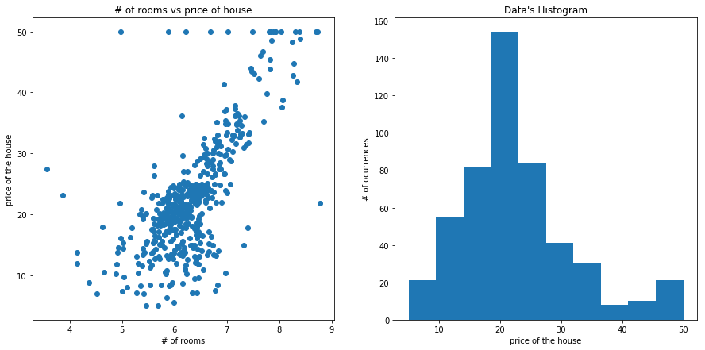


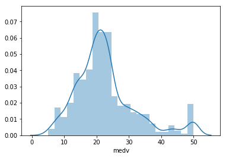


```python
plt.figure(figsize=(8,5))
plt.tight_layout()
sb.distplot(df_y)
```


    <matplotlib.axes._subplots.AxesSubplot at 0x27bdb6095c0>


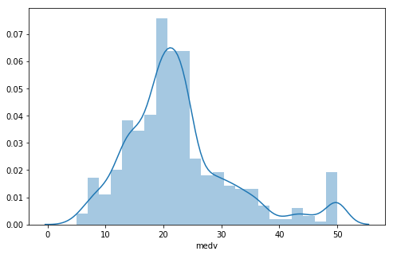


### SPLIT DATA


```python
x_train,x_test,y_train,y_test = train_test_split(df["rm"],df["medv"], test_size=0.3)
```

#### Taking a look at the format of the data


```python
x_train.head()
#need to take index out to run the regression in "regr.fit"
```


    217    6.642
    273    7.691
    73     6.245
    55     7.249
    442    6.219
    Name: rm, dtype: float64


### Starting Regression


```python
# Create linear regression object
regression = linear_model.LinearRegression()
```


```python
#this will take the index out
#x_train = x_train[:,None]
```


```python
# Train the model using the training sets
#without the none it give a data format problem and ask to reshape
regression.fit(x_train[:,None], y_train) 
```


    LinearRegression(copy_X=True, fit_intercept=True, n_jobs=None,
             normalize=False)


```python
# Make predictions using the testing set
#will return array with values predicted, it will be in the same order as y_test
data_y_pred = regression.predict(x_test[:,None])
```

#### REGRESSION ERRORS:


```python
#loading image with code
from IPython.display import Image
Image(filename='C:/Users/mateus_silva1/Python_Jupyter_Studies/images/regression_errors.PNG')
```


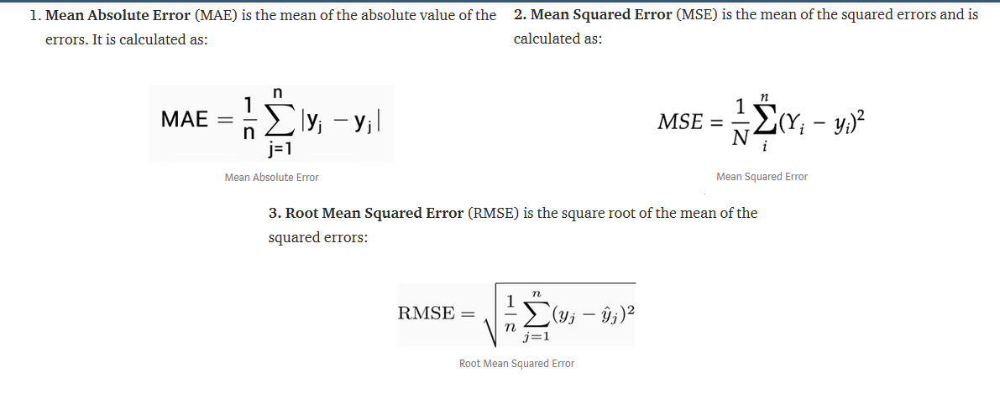


### First look at some metrics, later on I go deeper calculating them manually


```python
# The coefficient and Slope
print('Coefficient: {} and Slope: {}'.format(regression.coef_,regression.intercept_))
print('linear function is y={} + {}x'.format(regression.intercept_,regression.coef_))
# The mean squared error
print("Mean squared error: %.2f" % mean_squared_error(y_test, data_y_pred))
# Explained variance score: 1 is perfect prediction
print('Variance score: R2 %.2f' % r2_score(y_test, data_y_pred))

```

    Coefficient: [8.65694281] and Slope: -32.054215099207084
    linear function is y=-32.054215099207084 + [8.65694281]x
    Mean squared error: 40.01
    Variance score: R2 0.54
    

#### Doing some manual work to do some tests and play with the data

### Putting Y_Test and Predict_Test in a DF and Plotting IT to see Differences


```python
#using dictionary to do it
df_compare = pd.DataFrame({
                           'Test Data - Original Values': y_test, 
                           'Test Data - Predicted': data_y_pred
                          })
df_compare.index.name = "Index"
#resetting index (won't be able to see the number of the house)
#df_compare = df_compare.reset_index(drop=True)
df_compare["Difference"] = df_compare["Test Data - Original Values"] - df_compare["Test Data - Predicted"]
df_compare.head()
```


<div>
<style scoped>
    .dataframe tbody tr th:only-of-type {
        vertical-align: middle;
    }

    .dataframe tbody tr th {
        vertical-align: top;
    }

    .dataframe thead th {
        text-align: right;
    }
</style>
<table border="1" class="dataframe">
  <thead>
    <tr style="text-align: right;">
      <th></th>
      <th>Test Data - Original Values</th>
      <th>Test Data - Predicted</th>
      <th>Difference</th>
    </tr>
    <tr>
      <th>Index</th>
      <th></th>
      <th></th>
      <th></th>
    </tr>
  </thead>
  <tbody>
    <tr>
      <th>186</th>
      <td>50.0</td>
      <td>35.738304</td>
      <td>14.261696</td>
    </tr>
    <tr>
      <th>133</th>
      <td>18.4</td>
      <td>18.346506</td>
      <td>0.053494</td>
    </tr>
    <tr>
      <th>17</th>
      <td>17.5</td>
      <td>19.800872</td>
      <td>-2.300872</td>
    </tr>
    <tr>
      <th>204</th>
      <td>50.0</td>
      <td>37.495663</td>
      <td>12.504337</td>
    </tr>
    <tr>
      <th>256</th>
      <td>44.0</td>
      <td>32.474637</td>
      <td>11.525363</td>
    </tr>
  </tbody>
</table>
</div>


#### Plotting Difference from real data to predicted data


```python
df1 = df_compare.head(25)
df1 = df1.reset_index(drop=True)
df1.drop(["Difference"], axis=1, inplace=True) #INPLACE = TRUE FAZ DELETAR O DATAFRAME SEM TER QUE COPIAR PRA OUTRO DF
df1.plot(kind='bar',figsize=(15,5))
plt.grid(which='major', linestyle='-', linewidth='0.5', color='green')
plt.grid(which='minor', linestyle=':', linewidth='0.5', color='black')
plt.show()
```


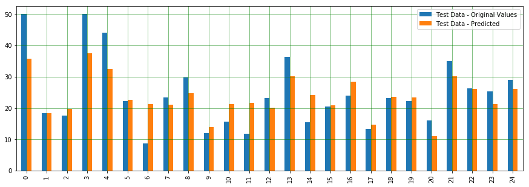


### Plotting REGRESSION for Test Data


```python
# Plot outputs
plt.scatter(x_test, y_test,  color='black')
plt.plot(x_test, data_y_pred, color='blue', linewidth=3) #plotting the prediction

plt.xticks((np.arange(3,10)))
plt.yticks((np.arange(60, step=5)))
plt.title("linear regression of # of rooms vs price of houses")

plt.show()
```


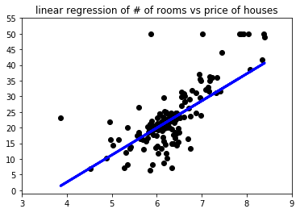


```python
# The coefficient and Slope
print('Coefficient: {} and Slope: {}'.format(regression.coef_,regression.intercept_))
#y = -30.0414 + 8.321*x
```

    Coefficient: [8.65694281] and Slope: -32.054215099207084
    

### RUN THE LINEAR EQUATION (y = slope + weight*x) TO GET AN ARRAY OF PREDICTED Y's to see difference by item


```python
#this is kind of redundant because data_y_pred already has this values > #data_y_pred = regression.predict(x_test[:,None])#
y_pred_manual = []
for item in x_test:
    result_pred_item = -30.0414423930087808+8.32072948*item
    y_pred_manual.append(result_pred_item)
#####Y_PRED_MANUAL HAS THE SAME VALUES AS  #data_y_pred = regression.predict(x_test[:,None])#
```

### transforming y_train to a dataframe to take out indexes


```python
df_y_test = pd.DataFrame(y_test)
np_array_y_test = df_y_test.values

```


```python
plt.plot(data_y_pred)
plt.plot(np_array_y_test)
```


    [<matplotlib.lines.Line2D at 0x27bdc254cc0>]


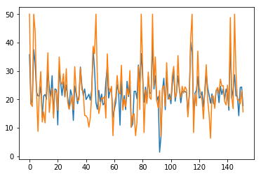


### Calculate and plot difference between predicted and real value in y_test


```python
difference_array = np_array_y_test - data_y_pred
diff_array = []
for item in range(152):
    result=np_array_y_test[item] - data_y_pred[item]
    diff_array.append(result)
    print ("first value in y_test is {}, prediction is {} and difference is {}".format(np_array_y_test[item],data_y_pred[item],diff_array[item]))
```

    first value in y_test is [50.], prediction is 35.73830404855839 and difference is [14.26169595]
    first value in y_test is [18.4], prediction is 18.346505942587143 and difference is [0.05349406]
    first value in y_test is [17.5], prediction is 19.80087233472411 and difference is [-2.30087233]
    first value in y_test is [50.], prediction is 37.495663439057225 and difference is [12.50433656]
    first value in y_test is [44.], prediction is 32.47463660906055 and difference is [11.52536339]
    first value in y_test is [22.3], prediction is 22.61437874808432 and difference is [-0.31437875]
    first value in y_test is [8.7], prediction is 21.203297069999046 and difference is [-12.50329707]
    first value in y_test is [23.3], prediction is 21.14269847032667 and difference is [2.15730153]
    first value in y_test is [29.8], prediction is 24.70070196537604 and difference is [5.09929803]
    first value in y_test is [12.], prediction is 13.862209566831488 and difference is [-1.86220957]
    first value in y_test is [15.6], prediction is 21.203297069999046 and difference is [-5.60329707]
    first value in y_test is [11.7], prediction is 21.688085867378028 and difference is [-9.98808587]
    first value in y_test is [23.2], prediction is 20.060580619034283 and difference is [3.13941938]
    first value in y_test is [36.4], prediction is 30.08532039340696 and difference is [6.31467961]
    first value in y_test is [15.4], prediction is 24.08605902584197 and difference is [-8.68605903]
    first value in y_test is [20.5], prediction is 20.8829901860165 and difference is [-0.38299019]
    first value in y_test is [23.9], prediction is 28.336617945718466 and difference is [-4.43661795]
    first value in y_test is [13.4], prediction is 14.719246905055059 and difference is [-1.31924691]
    first value in y_test is [23.2], prediction is 23.670525770945694 and difference is [-0.47052577]
    first value in y_test is [22.3], prediction is 23.36753277258382 and difference is [-1.06753277]
    first value in y_test is [16.1], prediction is 10.996761496609246 and difference is [5.1032385]
    first value in y_test is [34.9], prediction is 30.145918993079334 and difference is [4.75408101]
    first value in y_test is [26.2], prediction is 26.103126700650975 and difference is [0.0968733]
    first value in y_test is [25.3], prediction is 21.35046509777481 and difference is [3.9495349]
    first value in y_test is [29.], prediction is 26.17238224313369 and difference is [2.82761776]
    first value in y_test is [21.], prediction is 20.86567630039582 and difference is [0.1343237]
    first value in y_test is [30.8], prediction is 25.038322734979268 and difference is [5.76167727]
    first value in y_test is [19.1], prediction is 20.87433324320616 and difference is [-1.77433324]
    first value in y_test is [16.5], prediction is 16.693029865812377 and difference is [-0.19302987]
    first value in y_test is [18.6], prediction is 23.393503601014842 and difference is [-4.7935036]
    first value in y_test is [21.2], prediction is 21.411063697447183 and difference is [-0.2110637]
    first value in y_test is [16.3], prediction is 12.57232508809097 and difference is [3.72767491]
    first value in y_test is [31.5], prediction is 24.666074194134687 and difference is [6.83392581]
    first value in y_test is [23.], prediction is 21.982421922929575 and difference is [1.01757808]
    first value in y_test is [19.5], prediction is 18.467703141931892 and difference is [1.03229686]
    first value in y_test is [19.9], prediction is 21.333151212154142 and difference is [-1.43315121]
    first value in y_test is [31.], prediction is 31.375204872147492 and difference is [-0.37520487]
    first value in y_test is [23.3], prediction is 25.133549105892996 and difference is [-1.83354911]
    first value in y_test is [22.9], prediction is 21.333151212154142 and difference is [1.56684879]
    first value in y_test is [14.3], prediction is 23.661868828135347 and difference is [-9.36186883]
    first value in y_test is [14.2], prediction is 19.93938341968954 and difference is [-5.73938342]
    first value in y_test is [13.4], prediction is 20.77910687229243 and difference is [-7.37910687]
    first value in y_test is [10.2], prediction is 21.817940009533118 and difference is [-11.61794001]
    first value in y_test is [13.6], prediction is 19.740273735051737 and difference is [-6.14027374]
    first value in y_test is [21.7], prediction is 23.30693417291144 and difference is [-1.60693417]
    first value in y_test is [38.7], prediction is 37.79865643741908 and difference is [0.90134356]
    first value in y_test is [36.1], prediction is 30.587423076406637 and difference is [5.51257692]
    first value in y_test is [50.], prediction is 18.80532391153512 and difference is [31.19467609]
    first value in y_test is [26.4], prediction is 16.45929240993322 and difference is [9.94070759]
    first value in y_test is [15.], prediction is 23.15110920232535 and difference is [-8.1511092]
    first value in y_test is [17.8], prediction is 19.14294468113834 and difference is [-1.34294468]
    first value in y_test is [20.5], prediction is 21.84391083796414 and difference is [-1.34391084]
    first value in y_test is [20.3], prediction is 18.06948377265629 and difference is [2.23051623]
    first value in y_test is [21.], prediction is 18.588900341276634 and difference is [2.41109966]
    first value in y_test is [13.4], prediction is 26.371491927771487 and difference is [-12.97149193]
    first value in y_test is [36.], prediction is 31.427146529009512 and difference is [4.57285347]
    first value in y_test is [24.3], prediction is 20.458799988309885 and difference is [3.84120001]
    first value in y_test is [22.6], prediction is 23.49738691473891 and difference is [-0.89738691]
    first value in y_test is [24.6], prediction is 23.618584114083653 and difference is [0.98141589]
    first value in y_test is [7.2], prediction is 13.628472110952337 and difference is [-6.42847211]
    first value in y_test is [18.5], prediction is 16.467949352743567 and difference is [2.03205065]
    first value in y_test is [20.9], prediction is 18.891893339638507 and difference is [2.00810666]
    first value in y_test is [28.4], prediction is 25.22011853399639 and difference is [3.17988147]
    first value in y_test is [22.6], prediction is 22.770203718670416 and difference is [-0.17020372]
    first value in y_test is [21.9], prediction is 10.910192068505857 and difference is [10.98980793]
    first value in y_test is [32.], prediction is 26.65717104051268 and difference is [5.34282896]
    first value in y_test is [16.2], prediction is 17.229760320053394 and difference is [-1.02976032]
    first value in y_test is [20.1], prediction is 21.333151212154142 and difference is [-1.23315121]
    first value in y_test is [17.4], prediction is 16.372722981829824 and difference is [1.02727702]
    first value in y_test is [23.7], prediction is 26.380148870581827 and difference is [-2.68014887]
    first value in y_test is [21.5], prediction is 20.94358878568888 and difference is [0.55641121]
    first value in y_test is [30.1], prediction is 25.237432419617058 and difference is [4.86256758]
    first value in y_test is [10.2], prediction is 10.19166581524771 and difference is [0.00833418]
    first value in y_test is [14.4], prediction is 11.394980865884847 and difference is [3.00501913]
    first value in y_test is [14.9], prediction is 22.839459261153138 and difference is [-7.93945926]
    first value in y_test is [7.2], prediction is 22.85677314677381 and difference is [-15.65677315]
    first value in y_test is [11.9], prediction is 20.14715004713768 and difference is [-8.24715005]
    first value in y_test is [31.7], prediction is 32.11104501102632 and difference is [-0.41104501]
    first value in y_test is [16.4], prediction is 25.955958672875212 and difference is [-9.55595867]
    first value in y_test is [50.], prediction is 36.11920953221332 and difference is [13.88079047]
    first value in y_test is [31.2], prediction is 27.453609779063875 and difference is [3.74639022]
    first value in y_test is [8.3], prediction is 18.987119710552236 and difference is [-10.68711971]
    first value in y_test is [23.3], prediction is 24.30248259610044 and difference is [-1.0024826]
    first value in y_test is [18.5], prediction is 18.978462767741895 and difference is [-0.47846277]
    first value in y_test is [29.6], prediction is 28.17213603232203 and difference is [1.42786397]
    first value in y_test is [20.6], prediction is 22.043020522601935 and difference is [-1.44302052]
    first value in y_test is [20.], prediction is 22.302728806912114 and difference is [-2.30272881]
    first value in y_test is [50.], prediction is 40.447680937382856 and difference is [9.55231906]
    first value in y_test is [24.5], prediction is 23.635897999704333 and difference is [0.864102]
    first value in y_test is [34.9], prediction is 28.32796100290812 and difference is [6.572039]
    first value in y_test is [19.6], prediction is 19.584448764465634 and difference is [0.01555124]
    first value in y_test is [17.], prediction is 21.00418738536124 and difference is [-4.00418739]
    first value in y_test is [23.1], prediction is 1.3875549771328508 and difference is [21.71244502]
    first value in y_test is [7.], prediction is 7.066509460715302 and difference is [-0.06650946]
    first value in y_test is [23.9], prediction is 23.254992516049406 and difference is [0.64500748]
    first value in y_test is [24.8], prediction is 27.42763895063286 and difference is [-2.62763895]
    first value in y_test is [17.6], prediction is 16.36406603901949 and difference is [1.23593396]
    first value in y_test is [32.9], prediction is 29.71307185256238 and difference is [3.18692815]
    first value in y_test is [21.2], prediction is 20.05192367622395 and difference is [1.14807632]
    first value in y_test is [20.1], prediction is 21.8785386092055 and difference is [-1.77853861]
    first value in y_test is [19.9], prediction is 18.45038925631121 and difference is [1.44961074]
    first value in y_test is [28.4], prediction is 25.29803101928944 and difference is [3.10196898]
    first value in y_test is [31.6], prediction is 29.95546625125187 and difference is [1.64453375]
    first value in y_test is [20.6], prediction is 19.333397422965803 and difference is [1.26660258]
    first value in y_test is [22.2], prediction is 22.62303569089466 and difference is [-0.42303569]
    first value in y_test is [35.4], prediction is 28.26736240323575 and difference is [7.1326376]
    first value in y_test is [23.6], prediction is 23.48872997192857 and difference is [0.11127003]
    first value in y_test is [20.6], prediction is 18.770696140293765 and difference is [1.82930386]
    first value in y_test is [24.6], prediction is 22.61437874808432 and difference is [1.98562125]
    first value in y_test is [22.2], prediction is 22.9866272889289 and difference is [-0.78662729]
    first value in y_test is [24.4], prediction is 22.709605118998056 and difference is [1.69039488]
    first value in y_test is [23.5], prediction is 22.397955177825843 and difference is [1.10204482]
    first value in y_test is [13.8], prediction is 14.927013532503203 and difference is [-1.12701353]
    first value in y_test is [21.4], prediction is 21.69674281018837 and difference is [-0.29674281]
    first value in y_test is [41.7], prediction is 40.11871711058997 and difference is [1.58128289]
    first value in y_test is [50.], prediction is 36.53474278710958 and difference is [13.46525721]
    first value in y_test is [8.3], prediction is 14.25177199329675 and difference is [-5.95177199]
    first value in y_test is [21.6], prediction is 22.190188550377705 and difference is [-0.59018855]
    first value in y_test is [17.7], prediction is 23.142452259515004 and difference is [-5.44245226]
    first value in y_test is [37.], prediction is 28.120194375459988 and difference is [8.87980562]
    first value in y_test is [24.4], prediction is 20.441486102689204 and difference is [3.9585139]
    first value in y_test is [21.9], prediction is 20.822391586344125 and difference is [1.07760841]
    first value in y_test is [19.6], prediction is 22.709605118998056 and difference is [-3.10960512]
    first value in y_test is [13.1], prediction is 17.299015862536116 and difference is [-4.19901586]
    first value in y_test is [24.1], prediction is 22.250787150050073 and difference is [1.84921285]
    first value in y_test is [32.2], prediction is 29.306195540476438 and difference is [2.89380446]
    first value in y_test is [19.8], prediction is 23.99083265492824 and difference is [-4.19083265]
    first value in y_test is [14.6], prediction is 21.48897618274023 and difference is [-6.88897618]
    first value in y_test is [6.3], prediction is 18.606214226897322 and difference is [-12.30621423]
    first value in y_test is [21.2], prediction is 21.895852494826173 and difference is [-0.69585249]
    first value in y_test is [21.1], prediction is 18.64084199813867 and difference is [2.459158]
    first value in y_test is [16.8], prediction is 18.1820240291907 and difference is [-1.38202403]
    first value in y_test is [23.1], prediction is 23.194393916377045 and difference is [-0.09439392]
    first value in y_test is [24.2], prediction is 23.49738691473891 and difference is [0.70261309]
    first value in y_test is [22.], prediction is 18.831294739966125 and difference is [3.16870526]
    first value in y_test is [27.1], prediction is 24.640103365703666 and difference is [2.45989663]
    first value in y_test is [24.7], prediction is 21.714056695809056 and difference is [2.9859433]
    first value in y_test is [24.8], prediction is 23.679182713756028 and difference is [1.12081729]
    first value in y_test is [19.2], prediction is 20.069237561844623 and difference is [-0.86923756]
    first value in y_test is [18.], prediction is 23.618584114083653 and difference is [-5.61858411]
    first value in y_test is [25.], prediction is 21.714056695809056 and difference is [3.2859433]
    first value in y_test is [17.5], prediction is 16.156299411571354 and difference is [1.34370059]
    first value in y_test is [48.8], prediction is 40.64679062202066 and difference is [8.15320938]
    first value in y_test is [20.6], prediction is 20.39820138863751 and difference is [0.20179861]
    first value in y_test is [16.7], prediction is 23.445445257876877 and difference is [-6.74544526]
    first value in y_test is [50.], prediction is 28.682895658132026 and difference is [21.31710434]
    first value in y_test is [29.6], prediction is 21.21195401280938 and difference is [8.38804599]
    first value in y_test is [19.8], prediction is 21.134041527516338 and difference is [-1.33404153]
    first value in y_test is [20.], prediction is 14.208487279245048 and difference is [5.79151272]
    first value in y_test is [18.4], prediction is 24.172628453945357 and difference is [-5.77262845]
    first value in y_test is [23.1], prediction is 24.35442425296248 and difference is [-1.25442425]
    first value in y_test is [15.6], prediction is 17.783804659915106 and difference is [-2.18380466]
    

### Calculating squared error manually to see if it's equal to parameters from sklearn:  

#### Regression Metrics


```python
#loading image with code
from IPython.display import Image
Image(filename='C:/Users/mateus_silva1/Python_Jupyter_Studies/images/regression_metrics.PNG')
```


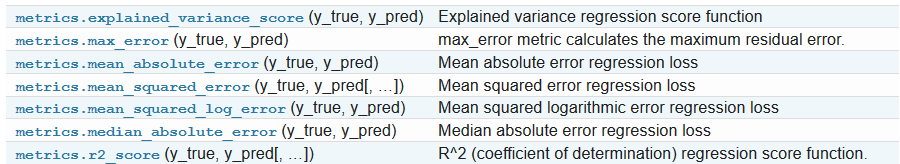


```python
print("Explained Variance Score: %.5f" % explained_variance_score(y_test, data_y_pred))
print("R2 SCORE: %.5f" % r2_score(y_test, data_y_pred))
```

    Explained Variance Score: 0.54912
    R2 SCORE: 0.54498
    

#### Errors Calculated with scykit


```python
print("Mean squared error: %.2f" % mean_squared_error(y_test, data_y_pred))
print("abs squared error: %.2f" % mean_absolute_error(y_test, data_y_pred))
print("root mean squared error: %.2f" % mean_squared_error(y_test, data_y_pred))
```

    Mean squared error: 40.01
    abs squared error: 4.22
    root mean squared error: 40.01
    

#### Errors manually calculated


```python
sum_var = 0
#mae = mean absolute error
mae = 0
for item in diff_array:
    squared = item*item
    sum_var = sum_var + squared
    if item < 0:
        mae += item*-1
    else:
        mae += item
mean_absolut_error = mae / len(diff_array)
mean_squared_error_manual = sum_var / len(diff_array)
print("mean absolute error is:", mean_absolut_error)
print("mean manual squared error is:", mean_squared_error_manual)
import math
print("root manual mean square error is:", math.sqrt(mean_squared_error_manual))
```

    mean absolute error is: [4.22337057]
    mean manual squared error is: [40.00655319]
    root manual mean square error is: 6.32507337451482
    


```python

```


```python

```


```python

```


```python
#loading image with code
from IPython.display import Image
Image(filename='C:/Users/mateus_silva1/Python_Jupyter_Studies/images/multiple_regression.PNG')
```


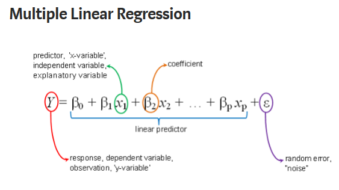


```python
import pandas as pd  
import numpy as np  
import matplotlib.pyplot as plt  
import seaborn as seabornInstance 
from sklearn.model_selection import train_test_split 
from sklearn.linear_model import LinearRegression
from sklearn import metrics
%matplotlib inline
```


```python
##LOAD DATA
url = "C:/Users/mateus_silva1/Documents/Data Science/Python Scripts/winequality.csv"
dataset = pd.read_csv(url)
```


```python
dataset.shape
```


    (1599, 12)


### Taking a look at the data


```python
wine_describe = dataset.describe()

#plt.plot(wine_describe.iloc[1:,:])
wine_describe = wine_describe.T
wine_describe.index.name = 'variables'
wine_describe
```


<div>
<style scoped>
    .dataframe tbody tr th:only-of-type {
        vertical-align: middle;
    }

    .dataframe tbody tr th {
        vertical-align: top;
    }

    .dataframe thead th {
        text-align: right;
    }
</style>
<table border="1" class="dataframe">
  <thead>
    <tr style="text-align: right;">
      <th></th>
      <th>count</th>
      <th>mean</th>
      <th>std</th>
      <th>min</th>
      <th>25%</th>
      <th>50%</th>
      <th>75%</th>
      <th>max</th>
    </tr>
    <tr>
      <th>variables</th>
      <th></th>
      <th></th>
      <th></th>
      <th></th>
      <th></th>
      <th></th>
      <th></th>
      <th></th>
    </tr>
  </thead>
  <tbody>
    <tr>
      <th>fixed acidity</th>
      <td>1599.0</td>
      <td>8.319637</td>
      <td>1.741096</td>
      <td>4.60000</td>
      <td>7.1000</td>
      <td>7.90000</td>
      <td>9.200000</td>
      <td>15.90000</td>
    </tr>
    <tr>
      <th>volatile acidity</th>
      <td>1599.0</td>
      <td>0.527821</td>
      <td>0.179060</td>
      <td>0.12000</td>
      <td>0.3900</td>
      <td>0.52000</td>
      <td>0.640000</td>
      <td>1.58000</td>
    </tr>
    <tr>
      <th>citric acid</th>
      <td>1599.0</td>
      <td>0.270976</td>
      <td>0.194801</td>
      <td>0.00000</td>
      <td>0.0900</td>
      <td>0.26000</td>
      <td>0.420000</td>
      <td>1.00000</td>
    </tr>
    <tr>
      <th>residual sugar</th>
      <td>1599.0</td>
      <td>2.538806</td>
      <td>1.409928</td>
      <td>0.90000</td>
      <td>1.9000</td>
      <td>2.20000</td>
      <td>2.600000</td>
      <td>15.50000</td>
    </tr>
    <tr>
      <th>chlorides</th>
      <td>1599.0</td>
      <td>0.087467</td>
      <td>0.047065</td>
      <td>0.01200</td>
      <td>0.0700</td>
      <td>0.07900</td>
      <td>0.090000</td>
      <td>0.61100</td>
    </tr>
    <tr>
      <th>free sulfur dioxide</th>
      <td>1599.0</td>
      <td>15.874922</td>
      <td>10.460157</td>
      <td>1.00000</td>
      <td>7.0000</td>
      <td>14.00000</td>
      <td>21.000000</td>
      <td>72.00000</td>
    </tr>
    <tr>
      <th>total sulfur dioxide</th>
      <td>1599.0</td>
      <td>46.467792</td>
      <td>32.895324</td>
      <td>6.00000</td>
      <td>22.0000</td>
      <td>38.00000</td>
      <td>62.000000</td>
      <td>289.00000</td>
    </tr>
    <tr>
      <th>density</th>
      <td>1599.0</td>
      <td>0.996747</td>
      <td>0.001887</td>
      <td>0.99007</td>
      <td>0.9956</td>
      <td>0.99675</td>
      <td>0.997835</td>
      <td>1.00369</td>
    </tr>
    <tr>
      <th>pH</th>
      <td>1599.0</td>
      <td>3.311113</td>
      <td>0.154386</td>
      <td>2.74000</td>
      <td>3.2100</td>
      <td>3.31000</td>
      <td>3.400000</td>
      <td>4.01000</td>
    </tr>
    <tr>
      <th>sulphates</th>
      <td>1599.0</td>
      <td>0.658149</td>
      <td>0.169507</td>
      <td>0.33000</td>
      <td>0.5500</td>
      <td>0.62000</td>
      <td>0.730000</td>
      <td>2.00000</td>
    </tr>
    <tr>
      <th>alcohol</th>
      <td>1599.0</td>
      <td>10.422983</td>
      <td>1.065668</td>
      <td>8.40000</td>
      <td>9.5000</td>
      <td>10.20000</td>
      <td>11.100000</td>
      <td>14.90000</td>
    </tr>
    <tr>
      <th>quality</th>
      <td>1599.0</td>
      <td>5.636023</td>
      <td>0.807569</td>
      <td>3.00000</td>
      <td>5.0000</td>
      <td>6.00000</td>
      <td>6.000000</td>
      <td>8.00000</td>
    </tr>
  </tbody>
</table>
</div>


```python
sb.pairplot(dataset)
plt.show()
```


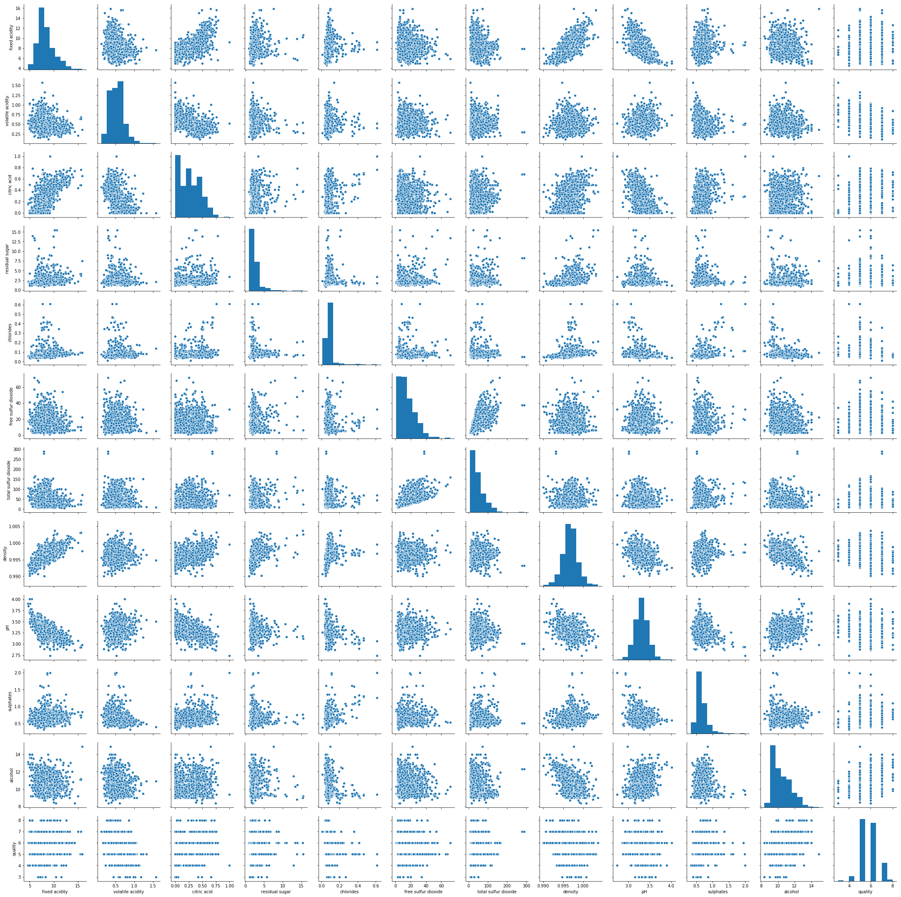


```python
# Multiple box plots on one Axes (to see distribution of variables)
fig, ax = plt.subplots()
ax.boxplot(wine_describe.iloc[:,2:])
ax.set_xticklabels(wine_describe.index, rotation="vertical")
```


    [Text(0, 0, 'fixed acidity'),
     Text(0, 0, 'volatile acidity'),
     Text(0, 0, 'citric acid'),
     Text(0, 0, 'residual sugar'),
     Text(0, 0, 'chlorides'),
     Text(0, 0, 'free sulfur dioxide'),
     Text(0, 0, 'total sulfur dioxide'),
     Text(0, 0, 'density'),
     Text(0, 0, 'pH'),
     Text(0, 0, 'sulphates'),
     Text(0, 0, 'alcohol'),
     Text(0, 0, 'quality')]


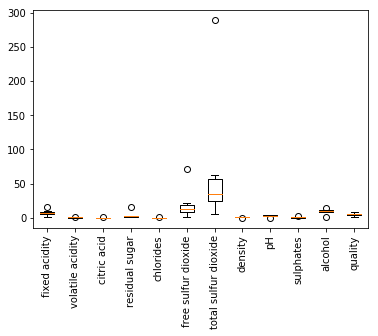


```python
#SEABORN HEATMAP
plt.show()
#heatmap
corr_wine = wine_describe.corr()
plt.figure(figsize=(10, 5))
sb.heatmap(corr_wine, annot=True, cmap="Blues")
```


    <matplotlib.axes._subplots.AxesSubplot at 0x27bd28784e0>


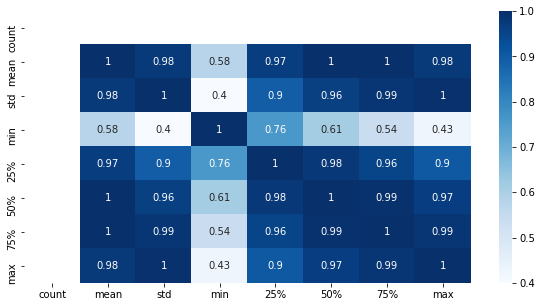


### Cleaning NAs


```python
dataset.isnull().any()
#taking NAs out
dataset = dataset.fillna(method='ffill')
```

### DIVIDE DATA BETWEEN VARIABLES AND TARGET: using numpy arrays now, not dataframes


```python
x_wine = dataset[['fixed acidity', 'volatile acidity', 'citric acid', 'residual sugar', 
             'chlorides', 'free sulfur dioxide', 'total sulfur dioxide', 'density', 
             'pH', 'sulphates','alcohol']].values
y_wine = dataset['quality'].values


```

#### Check avg. value of "quality (y)" target variable


```python
plt.figure(figsize=(10,5))
plt.tight_layout()
sb.distplot(dataset['quality'])
```

    C:\Users\mateus_silva1\AppData\Local\Continuum\anaconda3\lib\site-packages\scipy\stats\stats.py:1713: FutureWarning: Using a non-tuple sequence for multidimensional indexing is deprecated; use `arr[tuple(seq)]` instead of `arr[seq]`. In the future this will be interpreted as an array index, `arr[np.array(seq)]`, which will result either in an error or a different result.
      return np.add.reduce(sorted[indexer] * weights, axis=axis) / sumval
    


    <matplotlib.axes._subplots.AxesSubplot at 0x27bd24528d0>


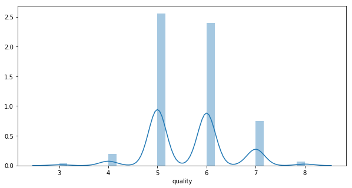


### SPLIT DATA


```python
X_train, X_test, y_train, y_test = train_test_split(x_wine, y_wine, test_size=0.2, random_state=0)
```

### Train the Model


```python
regressor = LinearRegression()  
regressor.fit(X_train, y_train)
```


    LinearRegression(copy_X=True, fit_intercept=True, n_jobs=None,
             normalize=False)


#### Seeing coefficients for many variables and slope


```python
#just getting the columns I need from a df (creating df first)
x_wine_to_columns = dataset[['fixed acidity', 'volatile acidity', 'citric acid', 'residual sugar', 
             'chlorides', 'free sulfur dioxide', 'total sulfur dioxide', 'density', 
             'pH', 'sulphates','alcohol']]
coeff_df = pd.DataFrame(regressor.coef_, x_wine_to_columns.columns, columns=['Coefficient'])  
print("the coefficients are: \n\n",coeff_df)
#unit increase in density equals to 31 decrease in quality
print("\n\nthe slope is: ",regressor.intercept_)
print("bar chart of the coefficients: \n")
plt.bar(coeff_df.index,coeff_df["Coefficient"])
plt.xticks(rotation=90)
```

    the coefficients are: 
    
                           Coefficient
    fixed acidity            0.041284
    volatile acidity        -1.149528
    citric acid             -0.177927
    residual sugar           0.027870
    chlorides               -1.873407
    free sulfur dioxide      0.002684
    total sulfur dioxide    -0.002777
    density                -31.516666
    pH                      -0.254486
    sulphates                0.924040
    alcohol                  0.267797
    
    
    the slope is:  34.9987106287214
    bar chart of the coefficients: 
    
    


    ([0, 1, 2, 3, 4, 5, 6, 7, 8, 9, 10], <a list of 11 Text xticklabel objects>)


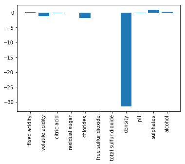


### PREDICT WITH THE TEST SET


```python
y_pred = regressor.predict(X_test)
```

#### Check differences between actual and predicted values


```python
#PUTTING ACTUAL VALUE AND DIFFERENCES IN A DATAFRAME
df_diff = pd.DataFrame({'Actual': y_test, 'Predicted': y_pred})
differences_wine_25sample = df_diff.head(25)
#PLOT DIFFERENCES
differences_wine_25sample.plot(kind='bar',figsize=(10,4))
plt.grid(which='major', linestyle='-', linewidth='0.5', color='green')
plt.grid(which='minor', linestyle=':', linewidth='0.5', color='black')
plt.show()
```


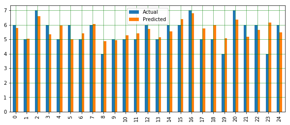


### CHECKING PERFORMANCE METRICS (first taking a look at the quality (y) variable)


```python
#box plots on one Axes (to see distribution of TARGET Variable)
fig, ax = plt.subplots()
ax.boxplot(wine_describe.iloc[-1,2:])
ax.set_xticklabels(["quality"], rotation="vertical")
print('Mean Absolute Error:', metrics.mean_absolute_error(y_test, y_pred))  
print('Mean Squared Error:', metrics.mean_squared_error(y_test, y_pred))  
print('Root Mean Squared Error:', np.sqrt(metrics.mean_squared_error(y_test, y_pred)))
#ROOT SQUARED ERROR IS 10% BIGGER THAN MEAN OF Y VARIABLE: not very accurate, but not that bad.
```

    Mean Absolute Error: 0.46963309286611005
    Mean Squared Error: 0.3844711978201237
    Root Mean Squared Error: 0.6200574149384263
    


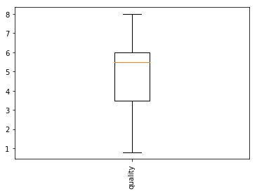


```python

```

## PCA AND REGRESSION WITH PCRegression Library


```python
import PCRegression as pcr
from PCRegression import *
```


```python
##LOAD DATA
url = "C:/Users/mateus_silva1/Documents/Data Science/Python Scripts/winequality.csv"
dataset = pd.read_csv(url)
dataset.isnull().any()
#taking NAs out
dataset = dataset.fillna(method='ffill')
x_wine = dataset[['fixed acidity', 'volatile acidity', 'citric acid', 'residual sugar', 
             'chlorides', 'free sulfur dioxide', 'total sulfur dioxide', 'density', 
             'pH', 'sulphates','alcohol']].values
y_wine = dataset['quality'].values
```

### SPLITTING AND DOING PCA


```python
X_train, X_test , y_train, y_test = train_test_split(x_wine, y_wine, test_size=0.2, random_state=1)
pcr = PCR(n_components = 4)
pcr.fit(scale(X_train), y_train) # Scale your predictors for best results.
predictions = pcr.predict(scale(X_test))
pcr
```


    PCR(copy=True, copy_X=True, fit_intercept=True, iterated_power='auto',
      n_components=4, n_jobs=1, normalize=False,
      random_state=RandomState(MT19937) at 0x27BCA1EE468, svd_solver='auto',
      tol=0.0, whiten=False)


```python
mse_c = mean_squared_error(predictions, y_test)
mse_c = mean_squared_error(predictions, y_test)
print(mse_c)
```

    0.40072085226854914
    

### Seeing differences


```python
#PUTTING ACTUAL VALUE AND DIFFERENCES IN A DATAFRAME
#normal prediction is from 2nd model in this page
df_diff = pd.DataFrame({'Actual': y_test, 'Predicted w PCR': predictions, 'normal_prediction': y_pred })
df_diff["diff from pcr"] = df_diff["Actual"] - df_diff["Predicted w PCR"]
df_diff["diff from multivariate"] = df_diff["Actual"] - df_diff["normal_prediction"]
differences_wine_25sample = df_diff.head(25)
print("diff from predicted w pcr sum: ", df_diff["diff from pcr"].sum())
print("diff from normal multiv prediction: ", df_diff["diff from multivariate"].sum())
#PLOT DIFFERENCES
differences_wine_25sample.iloc[:,:3].plot(kind='bar',figsize=(10,4))
plt.grid(which='major', linestyle='-', linewidth='0.5', color='green')
plt.grid(which='minor', linestyle=':', linewidth='0.5', color='black')
plt.show()
```

    diff from predicted w pcr sum:  -23.16262705242088
    diff from normal multiv prediction:  -27.814994322432625
    


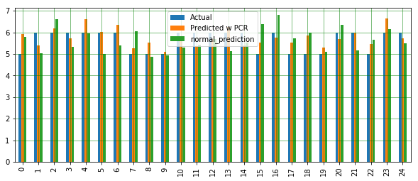


```python
df_diff.head()
```


<div>
<style scoped>
    .dataframe tbody tr th:only-of-type {
        vertical-align: middle;
    }

    .dataframe tbody tr th {
        vertical-align: top;
    }

    .dataframe thead th {
        text-align: right;
    }
</style>
<table border="1" class="dataframe">
  <thead>
    <tr style="text-align: right;">
      <th></th>
      <th>Actual</th>
      <th>Predicted w PCR</th>
      <th>normal_prediction</th>
      <th>diff from pcr</th>
      <th>diff from multivariate</th>
    </tr>
  </thead>
  <tbody>
    <tr>
      <th>0</th>
      <td>5</td>
      <td>5.923923</td>
      <td>5.782930</td>
      <td>-0.923923</td>
      <td>-0.782930</td>
    </tr>
    <tr>
      <th>1</th>
      <td>6</td>
      <td>5.410337</td>
      <td>5.036193</td>
      <td>0.589663</td>
      <td>0.963807</td>
    </tr>
    <tr>
      <th>2</th>
      <td>6</td>
      <td>6.196772</td>
      <td>6.596989</td>
      <td>-0.196772</td>
      <td>-0.596989</td>
    </tr>
    <tr>
      <th>3</th>
      <td>6</td>
      <td>5.725211</td>
      <td>5.339126</td>
      <td>0.274789</td>
      <td>0.660874</td>
    </tr>
    <tr>
      <th>4</th>
      <td>6</td>
      <td>6.597834</td>
      <td>5.939529</td>
      <td>-0.597834</td>
      <td>0.060471</td>
    </tr>
  </tbody>
</table>
</div>


## GLM (Generalized Linear Models) with  H2o


```python
from h2o.estimators.random_forest import H2ORandomForestEstimator

from h2o.estimators.gbm import H2OGradientBoostingEstimator

from h2o.estimators.stackedensemble import H2OStackedEnsembleEstimator
import pandas as pd
import numpy as np
import h2o
import csv

import h2o
import numpy as np
import pandas as pd
import urllib #data libraries
import sklearn
from sklearn.naive_bayes import BernoulliNB
from sklearn.naive_bayes import GaussianNB
from sklearn.naive_bayes import MultinomialNB
from sklearn.model_selection import train_test_split
from sklearn import metrics
from sklearn.metrics import accuracy_score
import urllib.request
from h2o.automl import H2OAutoML
```


```python
h2o.init()
```

    Checking whether there is an H2O instance running at http://localhost:54321 ..... not found.
    Attempting to start a local H2O server...
    ; Java HotSpot(TM) 64-Bit Server VM (build 25.221-b11, mixed mode)
      Starting server from C:\Users\mateus_silva1\AppData\Local\Continuum\anaconda3\lib\site-packages\h2o\backend\bin\h2o.jar
      Ice root: C:\Users\MATEUS~1\AppData\Local\Temp\tmpjawk3afe
      JVM stdout: C:\Users\MATEUS~1\AppData\Local\Temp\tmpjawk3afe\h2o_Mateus_S_Leao_started_from_python.out
      JVM stderr: C:\Users\MATEUS~1\AppData\Local\Temp\tmpjawk3afe\h2o_Mateus_S_Leao_started_from_python.err
      Server is running at http://127.0.0.1:54321
    Connecting to H2O server at http://127.0.0.1:54321 ... successful.
    


<div style="overflow:auto"><table style="width:50%"><tr><td>H2O cluster uptime:</td>
<td>04 secs</td></tr>
<tr><td>H2O cluster timezone:</td>
<td>America/Mexico_City</td></tr>
<tr><td>H2O data parsing timezone:</td>
<td>UTC</td></tr>
<tr><td>H2O cluster version:</td>
<td>3.26.0.6</td></tr>
<tr><td>H2O cluster version age:</td>
<td>20 days </td></tr>
<tr><td>H2O cluster name:</td>
<td>H2O_from_python_Mateus_S_Leao_36n2fi</td></tr>
<tr><td>H2O cluster total nodes:</td>
<td>1</td></tr>
<tr><td>H2O cluster free memory:</td>
<td>3.531 Gb</td></tr>
<tr><td>H2O cluster total cores:</td>
<td>0</td></tr>
<tr><td>H2O cluster allowed cores:</td>
<td>0</td></tr>
<tr><td>H2O cluster status:</td>
<td>accepting new members, healthy</td></tr>
<tr><td>H2O connection url:</td>
<td>http://127.0.0.1:54321</td></tr>
<tr><td>H2O connection proxy:</td>
<td>None</td></tr>
<tr><td>H2O internal security:</td>
<td>False</td></tr>
<tr><td>H2O API Extensions:</td>
<td>Amazon S3, Algos, AutoML, Core V3, TargetEncoder, Core V4</td></tr>
<tr><td>Python version:</td>
<td>3.7.1 final</td></tr></table></div>


```python
##LOAD DATA
url = "C:/Users/mateus_silva1/Documents/Data Science/Python Scripts/winequality.csv"
data_sample = h2o.import_file(url)
```

    Parse progress: |█████████████████████████████████████████████████████████| 100%
    


```python
data_split = data_sample.split_frame(ratios = [0.8], seed = 1234)
data_train = data_split[0] # using 80% for training
data_test = data_split[1] #rest 20% for testing
predictors = list(data_sample.columns)
predictors.remove('quality')
predictors
```


    ['fixed acidity',
     'volatile acidity',
     'citric acid',
     'residual sugar',
     'chlorides',
     'free sulfur dioxide',
     'total sulfur dioxide',
     'density',
     'pH',
     'sulphates',
     'alcohol']


```python
from h2o.automl import H2OAutoML
aml = H2OAutoML(max_models = 20, max_runtime_secs=100, seed = 1)
aml.train(x=predictors, y='quality', training_frame=data_train, validation_frame=data_test)
```

    AutoML progress: |████████████████████████████████████████████████████████| 100%
    


```python
print(aml.leaderboard)
```


<table>
<thead>
<tr><th>model_id                                           </th><th style="text-align: right;">  mean_residual_deviance</th><th style="text-align: right;">    rmse</th><th style="text-align: right;">     mse</th><th style="text-align: right;">     mae</th><th style="text-align: right;">    rmsle</th></tr>
</thead>
<tbody>
<tr><td>StackedEnsemble_BestOfFamily_AutoML_20191022_180725</td><td style="text-align: right;">                0.331145</td><td style="text-align: right;">0.575452</td><td style="text-align: right;">0.331145</td><td style="text-align: right;">0.414615</td><td style="text-align: right;">0.089272 </td></tr>
<tr><td>StackedEnsemble_AllModels_AutoML_20191022_180725   </td><td style="text-align: right;">                0.331483</td><td style="text-align: right;">0.575745</td><td style="text-align: right;">0.331483</td><td style="text-align: right;">0.415796</td><td style="text-align: right;">0.0893049</td></tr>
<tr><td>XRT_1_AutoML_20191022_180725                       </td><td style="text-align: right;">                0.334037</td><td style="text-align: right;">0.577959</td><td style="text-align: right;">0.334037</td><td style="text-align: right;">0.419006</td><td style="text-align: right;">0.0898612</td></tr>
<tr><td>DRF_1_AutoML_20191022_180725                       </td><td style="text-align: right;">                0.335269</td><td style="text-align: right;">0.579024</td><td style="text-align: right;">0.335269</td><td style="text-align: right;">0.421322</td><td style="text-align: right;">0.0898346</td></tr>
<tr><td>GBM_4_AutoML_20191022_180725                       </td><td style="text-align: right;">                0.345794</td><td style="text-align: right;">0.588042</td><td style="text-align: right;">0.345794</td><td style="text-align: right;">0.43737 </td><td style="text-align: right;">0.0910419</td></tr>
<tr><td>GBM_2_AutoML_20191022_180725                       </td><td style="text-align: right;">                0.354478</td><td style="text-align: right;">0.595381</td><td style="text-align: right;">0.354478</td><td style="text-align: right;">0.447942</td><td style="text-align: right;">0.0920959</td></tr>
<tr><td>GBM_3_AutoML_20191022_180725                       </td><td style="text-align: right;">                0.356351</td><td style="text-align: right;">0.596951</td><td style="text-align: right;">0.356351</td><td style="text-align: right;">0.445618</td><td style="text-align: right;">0.0924365</td></tr>
<tr><td>GBM_1_AutoML_20191022_180725                       </td><td style="text-align: right;">                0.372667</td><td style="text-align: right;">0.610465</td><td style="text-align: right;">0.372667</td><td style="text-align: right;">0.449573</td><td style="text-align: right;">0.0943823</td></tr>
<tr><td>GBM_5_AutoML_20191022_180725                       </td><td style="text-align: right;">                0.390384</td><td style="text-align: right;">0.624807</td><td style="text-align: right;">0.390384</td><td style="text-align: right;">0.478007</td><td style="text-align: right;">0.0961757</td></tr>
<tr><td>GLM_grid_1_AutoML_20191022_180725_model_1          </td><td style="text-align: right;">                0.415696</td><td style="text-align: right;">0.644745</td><td style="text-align: right;">0.415696</td><td style="text-align: right;">0.499326</td><td style="text-align: right;">0.0989162</td></tr>
</tbody>
</table>


    
    


```python
# Get model ids for all models in the AutoML Leaderboard
model_ids = list(aml.leaderboard['model_id'].as_data_frame().iloc[:,0])
# Get the "All Models" Stacked Ensemble model
se = h2o.get_model([mid for mid in model_ids if "StackedEnsemble_AllModels" in mid][0])
# Get the Stacked Ensemble metalearner model
metalearner = h2o.get_model(se.metalearner()['name'])

```


```python
metalearner.coef_norm()
```


    {'Intercept': 5.638198757763976,
     'XRT_1_AutoML_20191022_180725': 0.22431826458667817,
     'DRF_1_AutoML_20191022_180725': 0.19822995271415791,
     'GBM_4_AutoML_20191022_180725': 0.11042513697605964,
     'GBM_2_AutoML_20191022_180725': 0.0,
     'GBM_3_AutoML_20191022_180725': 0.0,
     'GBM_1_AutoML_20191022_180725': 0.0,
     'GBM_5_AutoML_20191022_180725': 0.0,
     'GLM_grid_1_AutoML_20191022_180725_model_1': 0.0,
     'DeepLearning_1_AutoML_20191022_180725': 0.0,
     'GBM_grid_1_AutoML_20191022_180725_model_1': 0.0,
     'DeepLearning_grid_1_AutoML_20191022_180725_model_3': 0.0,
     'DeepLearning_grid_1_AutoML_20191022_180725_model_1': 0.0,
     'GBM_grid_1_AutoML_20191022_180725_model_3': 0.0,
     'DeepLearning_grid_1_AutoML_20191022_180725_model_2': 0.0,
     'DeepLearning_grid_1_AutoML_20191022_180725_model_4': 0.02363311970831315,
     'GBM_grid_1_AutoML_20191022_180725_model_2': 0.0,
     'GBM_grid_1_AutoML_20191022_180725_model_5': 0.0,
     'GBM_grid_1_AutoML_20191022_180725_model_6': 0.0,
     'GBM_grid_1_AutoML_20191022_180725_model_4': 0.0}


```python
%matplotlib inline
metalearner.std_coef_plot()
```

    C:\Users\mateus_silva1\AppData\Local\Continuum\anaconda3\lib\site-packages\matplotlib\cbook\__init__.py:424: MatplotlibDeprecationWarning: 
    Passing one of 'on', 'true', 'off', 'false' as a boolean is deprecated; use an actual boolean (True/False) instead.
      warn_deprecated("2.2", "Passing one of 'on', 'true', 'off', 'false' as a "
    C:\Users\mateus_silva1\AppData\Local\Continuum\anaconda3\lib\site-packages\matplotlib\cbook\__init__.py:424: MatplotlibDeprecationWarning: 
    Passing one of 'on', 'true', 'off', 'false' as a boolean is deprecated; use an actual boolean (True/False) instead.
      warn_deprecated("2.2", "Passing one of 'on', 'true', 'off', 'false' as a "
    C:\Users\mateus_silva1\AppData\Local\Continuum\anaconda3\lib\site-packages\matplotlib\cbook\__init__.py:424: MatplotlibDeprecationWarning: 
    Passing one of 'on', 'true', 'off', 'false' as a boolean is deprecated; use an actual boolean (True/False) instead.
      warn_deprecated("2.2", "Passing one of 'on', 'true', 'off', 'false' as a "
    


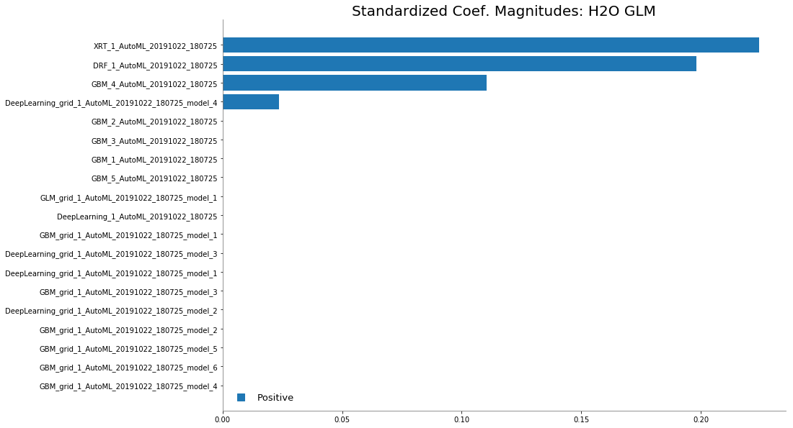


```python

```


```python

```


```python

```


```python

```


```python

```


```python

```


```python

```


```python

```


```python

```
